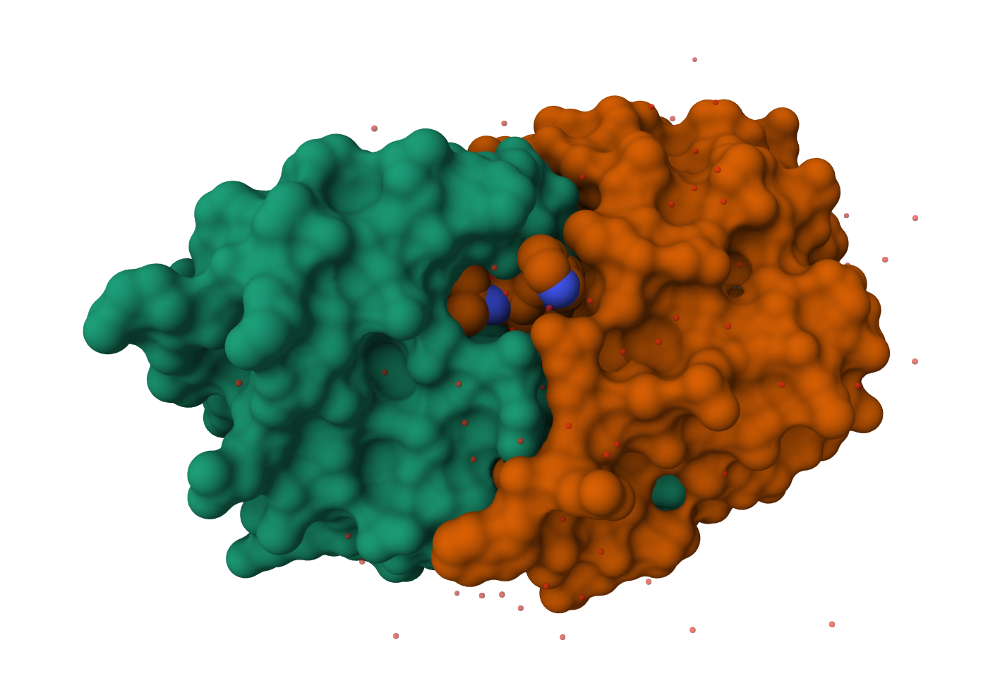
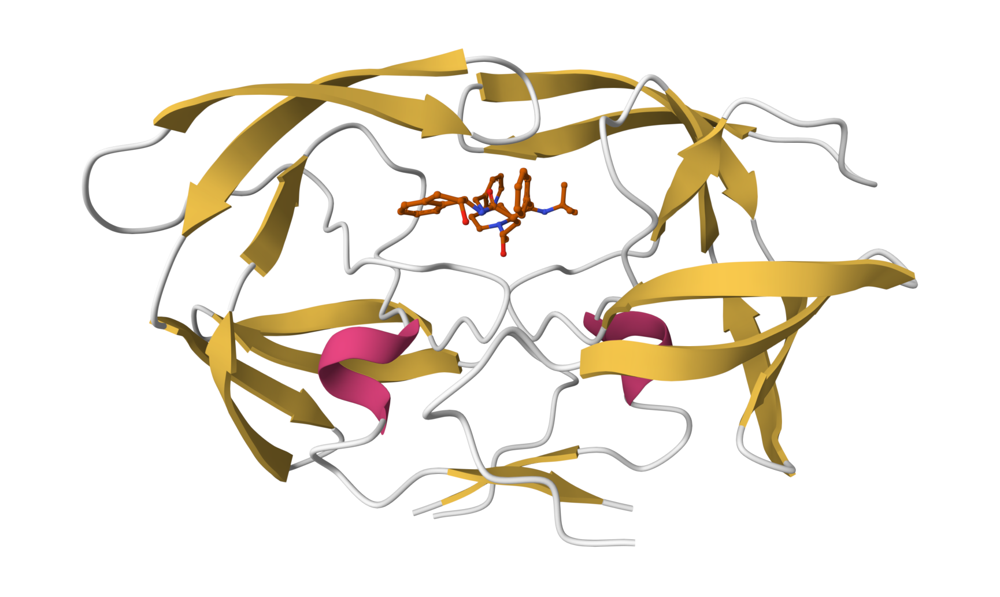
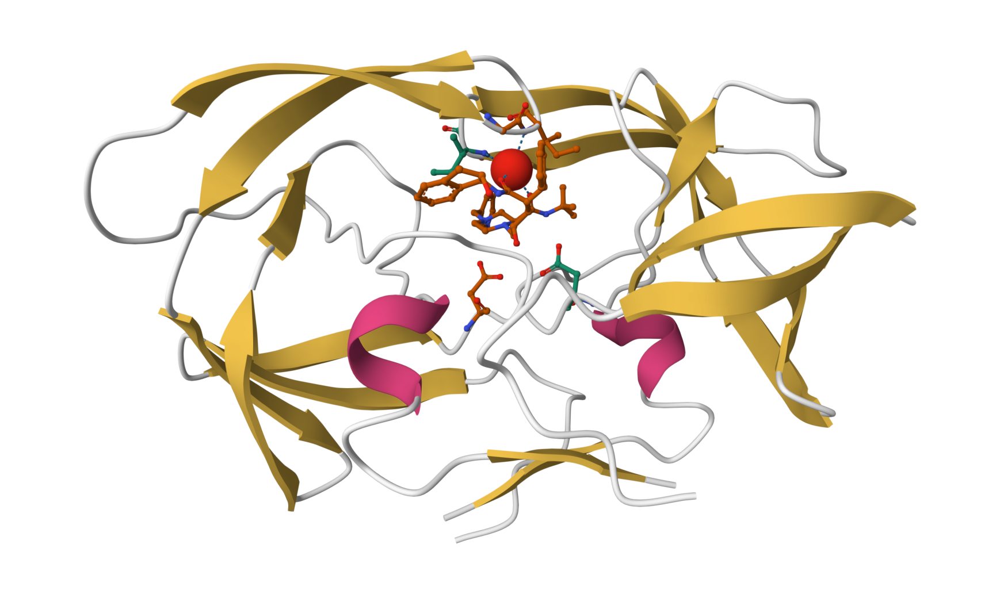
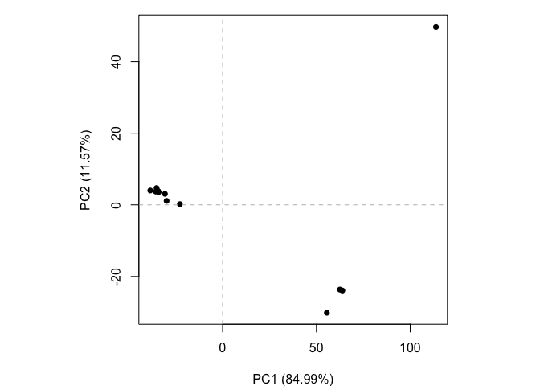

# Class 10: Structural Bioinformatics (pt. 1)
Saket Chodavarapu (PID: A18582086)

- [The PDB database](#the-pdb-database)
- [Using Molstar](#using-molstar)
- [The Bio3D package for structural
  bioinformatics](#the-bio3d-package-for-structural-bioinformatics)
  - [Quick viewing of PDBs](#quick-viewing-of-pdbs)
  - [Prediction of Protein
    flexibility](#prediction-of-protein-flexibility)
- [Comparative protein structure analysis with
  PCA](#comparative-protein-structure-analysis-with-pca)

## The PDB database

The [Protein Data Bank (PDB)](http://www.rcsb.org/) is the main
repository of biomolecular structure data. Let’s see what is in it:

> Q1: What percentage of structures in the PDB are solved by X-Ray and
> Electron Microscopy.

``` r
stats <- read.csv("pdb_stats.csv", row.names=1)
stats
```

                             X.ray    EM   NMR Integrative Multiple.methods Neutron
    Protein (only)          178795 21825 12773         343              226      84
    Protein/Oligosaccharide  10363  3564    34           8               11       1
    Protein/NA                9106  6335   287          24                7       0
    Nucleic acid (only)       3132   221  1566           3               15       3
    Other                      175    25    33           4                0       0
    Oligosaccharide (only)      11     0     6           0                1       0
                            Other  Total
    Protein (only)             32 214078
    Protein/Oligosaccharide     0  13981
    Protein/NA                  0  15759
    Nucleic acid (only)         1   4941
    Other                       0    237
    Oligosaccharide (only)      4     22

``` r
n.sums <- colSums(stats)
n <- n.sums/n.sums["Total"]
round(n, digits=2)
```

               X.ray               EM              NMR      Integrative 
                0.81             0.13             0.06             0.00 
    Multiple.methods          Neutron            Other            Total 
                0.00             0.00             0.00             1.00 

81% of structures in the PDB are solved by X-ray. 13% of structures in
the PDB are solved by Electron Microscopy.

> What is the total number of entries in the PDB?

``` r
n.sums["Total"]
```

     Total 
    249018 

> Q2: What proportion of structures in the PDB are protein?

``` r
round(stats["Protein (only)","Total"] / n.sums["Total"], digits=2)
```

    Total 
     0.86 

86% of structures in the PDB are protein.

## Using Molstar

We can use the main [Molstar viewer
online](https://molstar.org/viewer/):



> Q. Generate and insert an image of the HIV-Pr cartoon colored by
> secondary structure, showing the inhibitor (ligand) in ball and stick.



> Q. One final image showing catalytic APS 25 as ball and stick and the
> all-important active site water molecule as spacefill.



## The Bio3D package for structural bioinformatics

``` r
library(bio3d)

hiv <- read.pdb("1hsg")
```

      Note: Accessing on-line PDB file

``` r
hiv
```


     Call:  read.pdb(file = "1hsg")

       Total Models#: 1
         Total Atoms#: 1686,  XYZs#: 5058  Chains#: 2  (values: A B)

         Protein Atoms#: 1514  (residues/Calpha atoms#: 198)
         Nucleic acid Atoms#: 0  (residues/phosphate atoms#: 0)

         Non-protein/nucleic Atoms#: 172  (residues: 128)
         Non-protein/nucleic resid values: [ HOH (127), MK1 (1) ]

       Protein sequence:
          PQITLWQRPLVTIKIGGQLKEALLDTGADDTVLEEMSLPGRWKPKMIGGIGGFIKVRQYD
          QILIEICGHKAIGTVLVGPTPVNIIGRNLLTQIGCTLNFPQITLWQRPLVTIKIGGQLKE
          ALLDTGADDTVLEEMSLPGRWKPKMIGGIGGFIKVRQYDQILIEICGHKAIGTVLVGPTP
          VNIIGRNLLTQIGCTLNF

    + attr: atom, xyz, seqres, helix, sheet,
            calpha, remark, call

``` r
head(hiv$atom)
```

      type eleno elety  alt resid chain resno insert      x      y     z o     b
    1 ATOM     1     N <NA>   PRO     A     1   <NA> 29.361 39.686 5.862 1 38.10
    2 ATOM     2    CA <NA>   PRO     A     1   <NA> 30.307 38.663 5.319 1 40.62
    3 ATOM     3     C <NA>   PRO     A     1   <NA> 29.760 38.071 4.022 1 42.64
    4 ATOM     4     O <NA>   PRO     A     1   <NA> 28.600 38.302 3.676 1 43.40
    5 ATOM     5    CB <NA>   PRO     A     1   <NA> 30.508 37.541 6.342 1 37.87
    6 ATOM     6    CG <NA>   PRO     A     1   <NA> 29.296 37.591 7.162 1 38.40
      segid elesy charge
    1  <NA>     N   <NA>
    2  <NA>     C   <NA>
    3  <NA>     C   <NA>
    4  <NA>     O   <NA>
    5  <NA>     C   <NA>
    6  <NA>     C   <NA>

``` r
pdbseq(hiv)
```

      1   2   3   4   5   6   7   8   9  10  11  12  13  14  15  16  17  18  19  20 
    "P" "Q" "I" "T" "L" "W" "Q" "R" "P" "L" "V" "T" "I" "K" "I" "G" "G" "Q" "L" "K" 
     21  22  23  24  25  26  27  28  29  30  31  32  33  34  35  36  37  38  39  40 
    "E" "A" "L" "L" "D" "T" "G" "A" "D" "D" "T" "V" "L" "E" "E" "M" "S" "L" "P" "G" 
     41  42  43  44  45  46  47  48  49  50  51  52  53  54  55  56  57  58  59  60 
    "R" "W" "K" "P" "K" "M" "I" "G" "G" "I" "G" "G" "F" "I" "K" "V" "R" "Q" "Y" "D" 
     61  62  63  64  65  66  67  68  69  70  71  72  73  74  75  76  77  78  79  80 
    "Q" "I" "L" "I" "E" "I" "C" "G" "H" "K" "A" "I" "G" "T" "V" "L" "V" "G" "P" "T" 
     81  82  83  84  85  86  87  88  89  90  91  92  93  94  95  96  97  98  99   1 
    "P" "V" "N" "I" "I" "G" "R" "N" "L" "L" "T" "Q" "I" "G" "C" "T" "L" "N" "F" "P" 
      2   3   4   5   6   7   8   9  10  11  12  13  14  15  16  17  18  19  20  21 
    "Q" "I" "T" "L" "W" "Q" "R" "P" "L" "V" "T" "I" "K" "I" "G" "G" "Q" "L" "K" "E" 
     22  23  24  25  26  27  28  29  30  31  32  33  34  35  36  37  38  39  40  41 
    "A" "L" "L" "D" "T" "G" "A" "D" "D" "T" "V" "L" "E" "E" "M" "S" "L" "P" "G" "R" 
     42  43  44  45  46  47  48  49  50  51  52  53  54  55  56  57  58  59  60  61 
    "W" "K" "P" "K" "M" "I" "G" "G" "I" "G" "G" "F" "I" "K" "V" "R" "Q" "Y" "D" "Q" 
     62  63  64  65  66  67  68  69  70  71  72  73  74  75  76  77  78  79  80  81 
    "I" "L" "I" "E" "I" "C" "G" "H" "K" "A" "I" "G" "T" "V" "L" "V" "G" "P" "T" "P" 
     82  83  84  85  86  87  88  89  90  91  92  93  94  95  96  97  98  99 
    "V" "N" "I" "I" "G" "R" "N" "L" "L" "T" "Q" "I" "G" "C" "T" "L" "N" "F" 

Let’s try out the new **bio3dview** package that is not yet on CRAN. We
can use the **remotes** package to install any R package from GitHub.

### Quick viewing of PDBs

``` r
library(bio3dview)

sele <- atom.select(hiv, resno=25)

#view.pdb(hiv, backgroundColor="pink",
#         highlight = sele,
#         highlight.style = "spacefill")
```

### Prediction of Protein flexibility

``` r
adk <- read.pdb("6s36")
```

      Note: Accessing on-line PDB file
       PDB has ALT records, taking A only, rm.alt=TRUE

``` r
m <- nma(adk)
```

     Building Hessian...        Done in 0.013 seconds.
     Diagonalizing Hessian...   Done in 0.05 seconds.

``` r
plot(m)
```


Write out our results as a wee trajectory movie:

``` r
mktrj(m, file="results.pdb")
# view.nma(m)
```

## Comparative protein structure analysis with PCA

We start with a database id “1ake_A”

``` r
library(bio3d)

id <- "1ake_A"
aa <- get.seq(id)
```

    Warning in get.seq(id): Removing existing file: seqs.fasta

    Fetching... Please wait. Done.

``` r
#blast <- blast.pdb(aa)
```

Have a wee peek:

``` r
#head(blast$hit.tbl)
```

``` r
#hits <- plot(blast)
```

Peek at our “top hits”

``` r
hits <- NULL
hits$pdb.id <- c('1AKE_A','6S36_A','6RZE_A','3HPR_A','1E4V_A','5EJE_A','1E4Y_A','3X2S_A','6HAP_A','6HAM_A','4K46_A','3GMT_A','4PZL_A')

head(hits$pdb.id)
```

    [1] "1AKE_A" "6S36_A" "6RZE_A" "3HPR_A" "1E4V_A" "5EJE_A"

Now we can download these “top hits” these will all be ADK structures in
the PDB database.

``` r
files <- get.pdb(hits$pdb.id, path="pdbs", split=TRUE, gzip=TRUE)
```

    Warning in get.pdb(hits$pdb.id, path = "pdbs", split = TRUE, gzip = TRUE):
    pdbs/1AKE.pdb.gz exists. Skipping download

    Warning in get.pdb(hits$pdb.id, path = "pdbs", split = TRUE, gzip = TRUE):
    pdbs/6S36.pdb.gz exists. Skipping download

    Warning in get.pdb(hits$pdb.id, path = "pdbs", split = TRUE, gzip = TRUE):
    pdbs/6RZE.pdb.gz exists. Skipping download

    Warning in get.pdb(hits$pdb.id, path = "pdbs", split = TRUE, gzip = TRUE):
    pdbs/3HPR.pdb.gz exists. Skipping download

    Warning in get.pdb(hits$pdb.id, path = "pdbs", split = TRUE, gzip = TRUE):
    pdbs/1E4V.pdb.gz exists. Skipping download

    Warning in get.pdb(hits$pdb.id, path = "pdbs", split = TRUE, gzip = TRUE):
    pdbs/5EJE.pdb.gz exists. Skipping download

    Warning in get.pdb(hits$pdb.id, path = "pdbs", split = TRUE, gzip = TRUE):
    pdbs/1E4Y.pdb.gz exists. Skipping download

    Warning in get.pdb(hits$pdb.id, path = "pdbs", split = TRUE, gzip = TRUE):
    pdbs/3X2S.pdb.gz exists. Skipping download

    Warning in get.pdb(hits$pdb.id, path = "pdbs", split = TRUE, gzip = TRUE):
    pdbs/6HAP.pdb.gz exists. Skipping download

    Warning in get.pdb(hits$pdb.id, path = "pdbs", split = TRUE, gzip = TRUE):
    pdbs/6HAM.pdb.gz exists. Skipping download

    Warning in get.pdb(hits$pdb.id, path = "pdbs", split = TRUE, gzip = TRUE):
    pdbs/4K46.pdb.gz exists. Skipping download

    Warning in get.pdb(hits$pdb.id, path = "pdbs", split = TRUE, gzip = TRUE):
    pdbs/3GMT.pdb.gz exists. Skipping download

    Warning in get.pdb(hits$pdb.id, path = "pdbs", split = TRUE, gzip = TRUE):
    pdbs/4PZL.pdb.gz exists. Skipping download


      |                                                                            
      |                                                                      |   0%
      |                                                                            
      |=====                                                                 |   8%
      |                                                                            
      |===========                                                           |  15%
      |                                                                            
      |================                                                      |  23%
      |                                                                            
      |======================                                                |  31%
      |                                                                            
      |===========================                                           |  38%
      |                                                                            
      |================================                                      |  46%
      |                                                                            
      |======================================                                |  54%
      |                                                                            
      |===========================================                           |  62%
      |                                                                            
      |================================================                      |  69%
      |                                                                            
      |======================================================                |  77%
      |                                                                            
      |===========================================================           |  85%
      |                                                                            
      |=================================================================     |  92%
      |                                                                            
      |======================================================================| 100%

We need one package from BioConductor. To set this up we need to first
install a package called **“BiocManager”** from CRAN.

Now we can use the `install()` function from this package like this:
`BiocManager::install("msa")`

``` r
pdbs <- pdbaln(files, fit=TRUE, exefile="msa")
```

    Reading PDB files:
    pdbs/split_chain/1AKE_A.pdb
    pdbs/split_chain/6S36_A.pdb
    pdbs/split_chain/6RZE_A.pdb
    pdbs/split_chain/3HPR_A.pdb
    pdbs/split_chain/1E4V_A.pdb
    pdbs/split_chain/5EJE_A.pdb
    pdbs/split_chain/1E4Y_A.pdb
    pdbs/split_chain/3X2S_A.pdb
    pdbs/split_chain/6HAP_A.pdb
    pdbs/split_chain/6HAM_A.pdb
    pdbs/split_chain/4K46_A.pdb
    pdbs/split_chain/3GMT_A.pdb
    pdbs/split_chain/4PZL_A.pdb
       PDB has ALT records, taking A only, rm.alt=TRUE
    .   PDB has ALT records, taking A only, rm.alt=TRUE
    .   PDB has ALT records, taking A only, rm.alt=TRUE
    .   PDB has ALT records, taking A only, rm.alt=TRUE
    ..   PDB has ALT records, taking A only, rm.alt=TRUE
    ....   PDB has ALT records, taking A only, rm.alt=TRUE
    .   PDB has ALT records, taking A only, rm.alt=TRUE
    ...

    Extracting sequences

    pdb/seq: 1   name: pdbs/split_chain/1AKE_A.pdb 
       PDB has ALT records, taking A only, rm.alt=TRUE
    pdb/seq: 2   name: pdbs/split_chain/6S36_A.pdb 
       PDB has ALT records, taking A only, rm.alt=TRUE
    pdb/seq: 3   name: pdbs/split_chain/6RZE_A.pdb 
       PDB has ALT records, taking A only, rm.alt=TRUE
    pdb/seq: 4   name: pdbs/split_chain/3HPR_A.pdb 
       PDB has ALT records, taking A only, rm.alt=TRUE
    pdb/seq: 5   name: pdbs/split_chain/1E4V_A.pdb 
    pdb/seq: 6   name: pdbs/split_chain/5EJE_A.pdb 
       PDB has ALT records, taking A only, rm.alt=TRUE
    pdb/seq: 7   name: pdbs/split_chain/1E4Y_A.pdb 
    pdb/seq: 8   name: pdbs/split_chain/3X2S_A.pdb 
    pdb/seq: 9   name: pdbs/split_chain/6HAP_A.pdb 
    pdb/seq: 10   name: pdbs/split_chain/6HAM_A.pdb 
       PDB has ALT records, taking A only, rm.alt=TRUE
    pdb/seq: 11   name: pdbs/split_chain/4K46_A.pdb 
       PDB has ALT records, taking A only, rm.alt=TRUE
    pdb/seq: 12   name: pdbs/split_chain/3GMT_A.pdb 
    pdb/seq: 13   name: pdbs/split_chain/4PZL_A.pdb 

Let’s have a wee peek at our structures after “fitting” or superposing:

``` r
library(bio3dview)
#view.pdbs(pdbs)
```

``` r
#view.pdbs(pdbs, colorScheme = "residue")
```

We can run functions like `rmsd()`, `rmsf()`, and the best `pca()`

``` r
pc.xray <- pca(pdbs)
plot(pc.xray)
```


``` r
plot(pc.xray, 1:2)
```



Finally, let’s make a wee movie of the major “motion” or structural
difference in the dataset - we call this a “trajectory”

``` r
# mktrj(pc.xray, file="results2.pdb")
```
