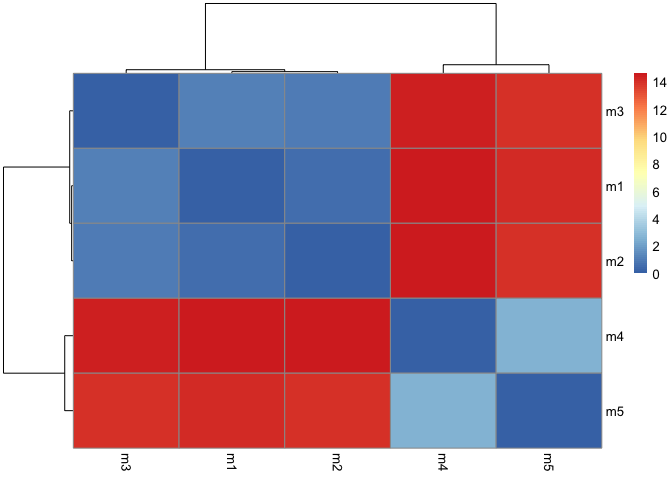
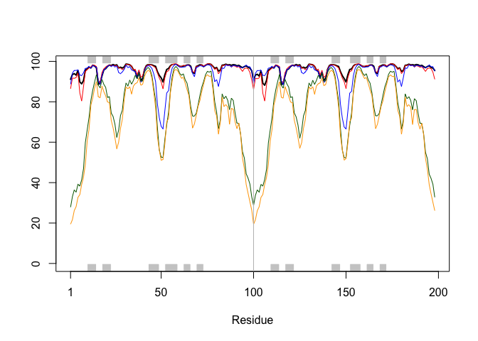
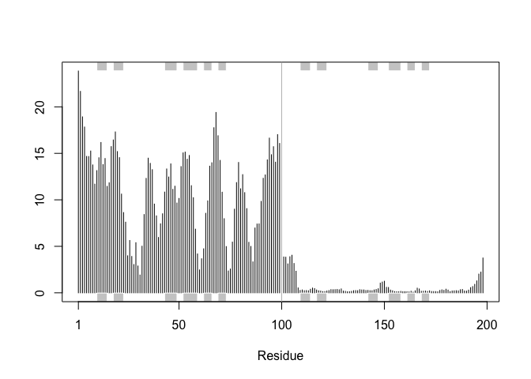
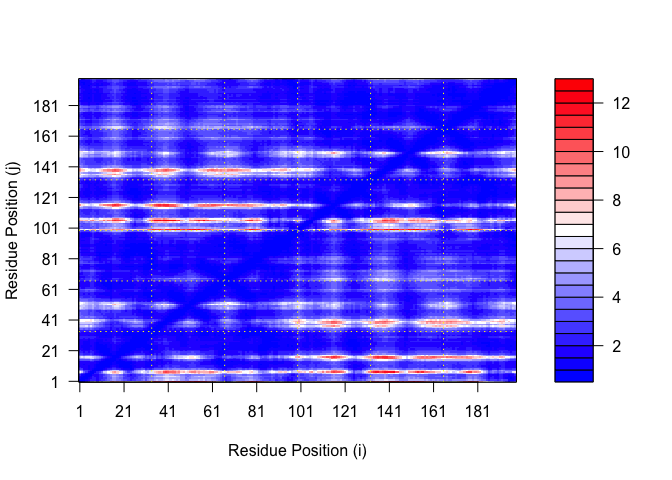
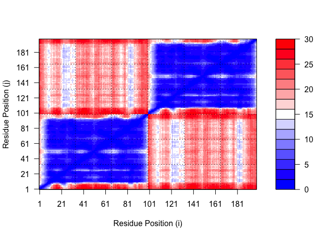
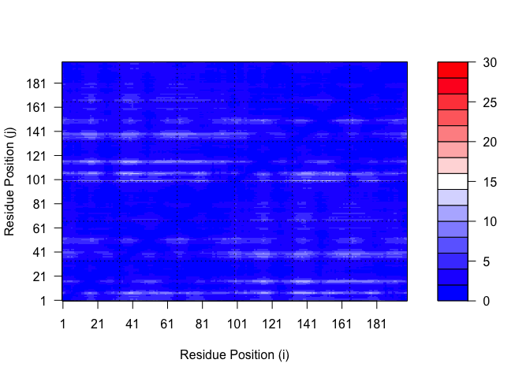

# Class 11: AlphaFold
Saket Chodavarapu (PID: A18582086)

- [Background](#background)
- [EBI AlphaFold Database](#ebi-alphafold-database)
- [Running AlphaFold](#running-alphafold)
  - [Predicted Alignment Error for
    domains](#predicted-alignment-error-for-domains)
  - [Residue conservation from alignment
    file](#residue-conservation-from-alignment-file)

## Background

In this hands-on session we will utilize AlphaFold to predict protein
structure from sequence (Jumper et al. 2021).

Without the aid of such approaches, it can take years of expensive
laboratory work to determine the structure of just one protein. With
AlphaFold we can now accurately compute a typical protein structure in
as little as ten minutes.

The PDB database (the main repository of experimental structures) only
has **~250 thousand** structures (we saw this in the last lab). The main
protein sequence database has over **200 million** sequences! Only
0.125% of known sequences have a known structure - this is called the
“structure knowledge gap”.

``` r
(250000 / 200000000) * 100
```

    [1] 0.125

- Structures are much harder to determine than sequences
- They are expensive (on average ~\$1 million each)
- They take on average 3-5 yeras to solve!

## EBI AlphaFold Database

The EBI has a database of pre-computed AlphaFold (AF) models called
AFDB. This is growing all the time and can be useful to check before
running AF ourselves.

## Running AlphaFold

We can download and run locally (on our own computers) but we need a
GPU. Or we can use “cloud” computing to run this on someone else’s
computers.

We will use ColabFold \< https://github.com/sokrypton/ColabFold \>

We previously found there was no AFDB entry for our HIV sequence:

    >HIV-Pr-Dimer
    PQITLWQRPLVTIKIGGQLKEALLDTGADDTVLEEMSLPGRWKPKMIGGIGGFIKVRQYD
    QILIEICGHKAIGTVLVGPTPVNIIGRNLLTQIGCTLNF:PQITLWQRPLVTIKIGGQLK
    EALLDTGADDTVLEEMSLPGRWKPKMIGGIGGFIKVRQYDQILIEICGHKAIGTVLVGPT
    PVNIIGRNLLTQIGCTLNF

Here we will use AlphaFold2_mmseqs2

``` r
results_dir <- "hivpr_23119"
```

``` r
# File names for all PDB models
pdb_files <- list.files(path=results_dir,
                        pattern="*pdb",
                        full.names = TRUE)

# Print our PDB files names
basename(pdb_files)
```

    [1] "hivpr_23119_unrelaxed_rank_001_alphafold2_multimer_v3_model_4_seed_000.pdb"
    [2] "hivpr_23119_unrelaxed_rank_002_alphafold2_multimer_v3_model_1_seed_000.pdb"
    [3] "hivpr_23119_unrelaxed_rank_003_alphafold2_multimer_v3_model_5_seed_000.pdb"
    [4] "hivpr_23119_unrelaxed_rank_004_alphafold2_multimer_v3_model_2_seed_000.pdb"
    [5] "hivpr_23119_unrelaxed_rank_005_alphafold2_multimer_v3_model_3_seed_000.pdb"

``` r
library(bio3d)

# Read all data from Models 
#  and superpose/fit coords
pdbs <- pdbaln(pdb_files, fit=TRUE, exefile="msa")
```

    Reading PDB files:
    hivpr_23119/hivpr_23119_unrelaxed_rank_001_alphafold2_multimer_v3_model_4_seed_000.pdb
    hivpr_23119/hivpr_23119_unrelaxed_rank_002_alphafold2_multimer_v3_model_1_seed_000.pdb
    hivpr_23119/hivpr_23119_unrelaxed_rank_003_alphafold2_multimer_v3_model_5_seed_000.pdb
    hivpr_23119/hivpr_23119_unrelaxed_rank_004_alphafold2_multimer_v3_model_2_seed_000.pdb
    hivpr_23119/hivpr_23119_unrelaxed_rank_005_alphafold2_multimer_v3_model_3_seed_000.pdb
    .....

    Extracting sequences

    pdb/seq: 1   name: hivpr_23119/hivpr_23119_unrelaxed_rank_001_alphafold2_multimer_v3_model_4_seed_000.pdb 
    pdb/seq: 2   name: hivpr_23119/hivpr_23119_unrelaxed_rank_002_alphafold2_multimer_v3_model_1_seed_000.pdb 
    pdb/seq: 3   name: hivpr_23119/hivpr_23119_unrelaxed_rank_003_alphafold2_multimer_v3_model_5_seed_000.pdb 
    pdb/seq: 4   name: hivpr_23119/hivpr_23119_unrelaxed_rank_004_alphafold2_multimer_v3_model_2_seed_000.pdb 
    pdb/seq: 5   name: hivpr_23119/hivpr_23119_unrelaxed_rank_005_alphafold2_multimer_v3_model_3_seed_000.pdb 

``` r
pdbs
```

                                   1        .         .         .         .         50 
    [Truncated_Name:1]hivpr_2311   PQITLWQRPLVTIKIGGQLKEALLDTGADDTVLEEMSLPGRWKPKMIGGI
    [Truncated_Name:2]hivpr_2311   PQITLWQRPLVTIKIGGQLKEALLDTGADDTVLEEMSLPGRWKPKMIGGI
    [Truncated_Name:3]hivpr_2311   PQITLWQRPLVTIKIGGQLKEALLDTGADDTVLEEMSLPGRWKPKMIGGI
    [Truncated_Name:4]hivpr_2311   PQITLWQRPLVTIKIGGQLKEALLDTGADDTVLEEMSLPGRWKPKMIGGI
    [Truncated_Name:5]hivpr_2311   PQITLWQRPLVTIKIGGQLKEALLDTGADDTVLEEMSLPGRWKPKMIGGI
                                   ************************************************** 
                                   1        .         .         .         .         50 

                                  51        .         .         .         .         100 
    [Truncated_Name:1]hivpr_2311   GGFIKVRQYDQILIEICGHKAIGTVLVGPTPVNIIGRNLLTQIGCTLNFP
    [Truncated_Name:2]hivpr_2311   GGFIKVRQYDQILIEICGHKAIGTVLVGPTPVNIIGRNLLTQIGCTLNFP
    [Truncated_Name:3]hivpr_2311   GGFIKVRQYDQILIEICGHKAIGTVLVGPTPVNIIGRNLLTQIGCTLNFP
    [Truncated_Name:4]hivpr_2311   GGFIKVRQYDQILIEICGHKAIGTVLVGPTPVNIIGRNLLTQIGCTLNFP
    [Truncated_Name:5]hivpr_2311   GGFIKVRQYDQILIEICGHKAIGTVLVGPTPVNIIGRNLLTQIGCTLNFP
                                   ************************************************** 
                                  51        .         .         .         .         100 

                                 101        .         .         .         .         150 
    [Truncated_Name:1]hivpr_2311   QITLWQRPLVTIKIGGQLKEALLDTGADDTVLEEMSLPGRWKPKMIGGIG
    [Truncated_Name:2]hivpr_2311   QITLWQRPLVTIKIGGQLKEALLDTGADDTVLEEMSLPGRWKPKMIGGIG
    [Truncated_Name:3]hivpr_2311   QITLWQRPLVTIKIGGQLKEALLDTGADDTVLEEMSLPGRWKPKMIGGIG
    [Truncated_Name:4]hivpr_2311   QITLWQRPLVTIKIGGQLKEALLDTGADDTVLEEMSLPGRWKPKMIGGIG
    [Truncated_Name:5]hivpr_2311   QITLWQRPLVTIKIGGQLKEALLDTGADDTVLEEMSLPGRWKPKMIGGIG
                                   ************************************************** 
                                 101        .         .         .         .         150 

                                 151        .         .         .         .       198 
    [Truncated_Name:1]hivpr_2311   GFIKVRQYDQILIEICGHKAIGTVLVGPTPVNIIGRNLLTQIGCTLNF
    [Truncated_Name:2]hivpr_2311   GFIKVRQYDQILIEICGHKAIGTVLVGPTPVNIIGRNLLTQIGCTLNF
    [Truncated_Name:3]hivpr_2311   GFIKVRQYDQILIEICGHKAIGTVLVGPTPVNIIGRNLLTQIGCTLNF
    [Truncated_Name:4]hivpr_2311   GFIKVRQYDQILIEICGHKAIGTVLVGPTPVNIIGRNLLTQIGCTLNF
    [Truncated_Name:5]hivpr_2311   GFIKVRQYDQILIEICGHKAIGTVLVGPTPVNIIGRNLLTQIGCTLNF
                                   ************************************************ 
                                 151        .         .         .         .       198 

    Call:
      pdbaln(files = pdb_files, fit = TRUE, exefile = "msa")

    Class:
      pdbs, fasta

    Alignment dimensions:
      5 sequence rows; 198 position columns (198 non-gap, 0 gap) 

    + attr: xyz, resno, b, chain, id, ali, resid, sse, call

``` r
rd <- rmsd(pdbs, fit=T)
```

    Warning in rmsd(pdbs, fit = T): No indices provided, using the 198 non NA positions

``` r
range(rd)
```

    [1]  0.000 14.628

``` r
library(pheatmap)

colnames(rd) <- paste0("m",1:5)
rownames(rd) <- paste0("m",1:5)
pheatmap(rd)
```



``` r
# Read a reference PDB structure
pdb <- read.pdb("1hsg")
```

      Note: Accessing on-line PDB file

``` r
plotb3(pdbs$b[1,], typ="l", lwd=2, sse=pdb)
points(pdbs$b[2,], typ="l", col="red")
points(pdbs$b[3,], typ="l", col="blue")
points(pdbs$b[4,], typ="l", col="darkgreen")
points(pdbs$b[5,], typ="l", col="orange")
abline(v=100, col="gray")
```



``` r
core <- core.find(pdbs)
```

     core size 197 of 198  vol = 8788.529 
     core size 196 of 198  vol = 3258.252 
     core size 195 of 198  vol = 1641.096 
     core size 194 of 198  vol = 1498.73 
     core size 193 of 198  vol = 1369.427 
     core size 192 of 198  vol = 1313.823 
     core size 191 of 198  vol = 1228.996 
     core size 190 of 198  vol = 1186.704 
     core size 189 of 198  vol = 1146.395 
     core size 188 of 198  vol = 1102.479 
     core size 187 of 198  vol = 1065.499 
     core size 186 of 198  vol = 1024.388 
     core size 185 of 198  vol = 990.444 
     core size 184 of 198  vol = 959.404 
     core size 183 of 198  vol = 896.555 
     core size 182 of 198  vol = 862.291 
     core size 181 of 198  vol = 813.796 
     core size 180 of 198  vol = 778.382 
     core size 179 of 198  vol = 752.381 
     core size 178 of 198  vol = 727.481 
     core size 177 of 198  vol = 701.894 
     core size 176 of 198  vol = 665.126 
     core size 175 of 198  vol = 645.103 
     core size 174 of 198  vol = 611.674 
     core size 173 of 198  vol = 592.081 
     core size 172 of 198  vol = 574.373 
     core size 171 of 198  vol = 557.314 
     core size 170 of 198  vol = 540.852 
     core size 169 of 198  vol = 521.716 
     core size 168 of 198  vol = 504.275 
     core size 167 of 198  vol = 486.79 
     core size 166 of 198  vol = 467.6 
     core size 165 of 198  vol = 453.621 
     core size 164 of 198  vol = 438.703 
     core size 163 of 198  vol = 416.355 
     core size 162 of 198  vol = 403.203 
     core size 161 of 198  vol = 389.116 
     core size 160 of 198  vol = 380.198 
     core size 159 of 198  vol = 368.51 
     core size 158 of 198  vol = 354.354 
     core size 157 of 198  vol = 345.969 
     core size 156 of 198  vol = 333.055 
     core size 155 of 198  vol = 323.291 
     core size 154 of 198  vol = 310.454 
     core size 153 of 198  vol = 298.867 
     core size 152 of 198  vol = 287.369 
     core size 151 of 198  vol = 274.702 
     core size 150 of 198  vol = 265.237 
     core size 149 of 198  vol = 253.87 
     core size 148 of 198  vol = 242.239 
     core size 147 of 198  vol = 231.934 
     core size 146 of 198  vol = 221.935 
     core size 145 of 198  vol = 212.751 
     core size 144 of 198  vol = 202.011 
     core size 143 of 198  vol = 190.404 
     core size 142 of 198  vol = 178.064 
     core size 141 of 198  vol = 166.007 
     core size 140 of 198  vol = 154.581 
     core size 139 of 198  vol = 148.005 
     core size 138 of 198  vol = 142.521 
     core size 137 of 198  vol = 137.976 
     core size 136 of 198  vol = 133.424 
     core size 135 of 198  vol = 127.466 
     core size 134 of 198  vol = 122.719 
     core size 133 of 198  vol = 116.921 
     core size 132 of 198  vol = 111.806 
     core size 131 of 198  vol = 107.066 
     core size 130 of 198  vol = 102.136 
     core size 129 of 198  vol = 95.713 
     core size 128 of 198  vol = 91.571 
     core size 127 of 198  vol = 87.169 
     core size 126 of 198  vol = 83.202 
     core size 125 of 198  vol = 79.384 
     core size 124 of 198  vol = 75.619 
     core size 123 of 198  vol = 72.22 
     core size 122 of 198  vol = 68.808 
     core size 121 of 198  vol = 65.053 
     core size 120 of 198  vol = 59.938 
     core size 119 of 198  vol = 56.462 
     core size 118 of 198  vol = 50.965 
     core size 117 of 198  vol = 47.711 
     core size 116 of 198  vol = 44.559 
     core size 115 of 198  vol = 42.227 
     core size 114 of 198  vol = 38.533 
     core size 113 of 198  vol = 35.532 
     core size 112 of 198  vol = 32.536 
     core size 111 of 198  vol = 30.047 
     core size 110 of 198  vol = 27.602 
     core size 109 of 198  vol = 25.46 
     core size 108 of 198  vol = 23.828 
     core size 107 of 198  vol = 21.844 
     core size 106 of 198  vol = 21.094 
     core size 105 of 198  vol = 18.919 
     core size 104 of 198  vol = 18.031 
     core size 103 of 198  vol = 16.952 
     core size 102 of 198  vol = 15.508 
     core size 101 of 198  vol = 13.766 
     core size 100 of 198  vol = 13.412 
     core size 99 of 198  vol = 12.055 
     core size 98 of 198  vol = 10.539 
     core size 97 of 198  vol = 9.331 
     core size 96 of 198  vol = 7.81 
     core size 95 of 198  vol = 6.417 
     core size 94 of 198  vol = 5.507 
     core size 93 of 198  vol = 4.463 
     core size 92 of 198  vol = 3.688 
     core size 91 of 198  vol = 2.703 
     core size 90 of 198  vol = 2.106 
     core size 89 of 198  vol = 1.512 
     core size 88 of 198  vol = 1.06 
     core size 87 of 198  vol = 0.777 
     core size 86 of 198  vol = 0.641 
     core size 85 of 198  vol = 0.524 
     core size 84 of 198  vol = 0.473 
     FINISHED: Min vol ( 0.5 ) reached

``` r
core.inds <- print(core, vol=0.5)
```

    # 85 positions (cumulative volume <= 0.5 Angstrom^3) 
      start end length
    1     8  48     41
    2    52  95     44

``` r
xyz <- pdbfit(pdbs, core.inds, outpath="corefit_structures")
```

``` r
rf <- rmsf(xyz)

plotb3(rf, sse=pdb)
abline(v=100, col="gray", ylab="RMSF")
```



### Predicted Alignment Error for domains

``` r
library(jsonlite)

# Listing of all PAE JSON files
pae_files <- list.files(path=results_dir,
                        pattern=".*model.*\\.json",
                        full.names = TRUE)
```

``` r
pae1 <- read_json(pae_files[1],simplifyVector = TRUE)
pae5 <- read_json(pae_files[5],simplifyVector = TRUE)

attributes(pae1)
```

    $names
    [1] "plddt"   "max_pae" "pae"     "ptm"     "iptm"   

``` r
# Per-residue pLDDT scores 
#  same as B-factor of PDB..
head(pae1$plddt) 
```

    [1] 91.12 93.50 93.94 93.19 95.50 89.81

``` r
pae1$max_pae
```

    [1] 12.70312

``` r
pae5$max_pae
```

    [1] 29.76562

``` r
plot.dmat(pae1$pae, 
          xlab="Residue Position (i)",
          ylab="Residue Position (j)")
```



``` r
plot.dmat(pae5$pae, 
          xlab="Residue Position (i)",
          ylab="Residue Position (j)",
          grid.col = "black",
          zlim=c(0,30))
```



``` r
plot.dmat(pae1$pae, 
          xlab="Residue Position (i)",
          ylab="Residue Position (j)",
          grid.col = "black",
          zlim=c(0,30))
```



### Residue conservation from alignment file

``` r
aln_file <- list.files(path=results_dir,
                       pattern=".a3m$",
                        full.names = TRUE)
aln_file
```

    [1] "hivpr_23119/hivpr_23119.a3m"

``` r
aln <- read.fasta(aln_file[1], to.upper = TRUE)
```

    [1] " ** Duplicated sequence id's: 101 **"
    [2] " ** Duplicated sequence id's: 101 **"

``` r
dim(aln$ali)
```

    [1] 5397  132

``` r
sim <- conserv(aln)
```

``` r
plotb3(sim[1:99], sse=trim.pdb(pdb, chain="A"),
       ylab="Conservation Score")
```


``` r
con <- consensus(aln, cutoff = 0.9)
con$seq
```

      [1] "-" "-" "-" "-" "-" "-" "-" "-" "-" "-" "-" "-" "-" "-" "-" "-" "-" "-"
     [19] "-" "-" "-" "-" "-" "-" "D" "T" "G" "A" "-" "-" "-" "-" "-" "-" "-" "-"
     [37] "-" "-" "-" "-" "-" "-" "-" "-" "-" "-" "-" "-" "-" "-" "-" "-" "-" "-"
     [55] "-" "-" "-" "-" "-" "-" "-" "-" "-" "-" "-" "-" "-" "-" "-" "-" "-" "-"
     [73] "-" "-" "-" "-" "-" "-" "-" "-" "-" "-" "-" "-" "-" "-" "-" "-" "-" "-"
     [91] "-" "-" "-" "-" "-" "-" "-" "-" "-" "-" "-" "-" "-" "-" "-" "-" "-" "-"
    [109] "-" "-" "-" "-" "-" "-" "-" "-" "-" "-" "-" "-" "-" "-" "-" "-" "-" "-"
    [127] "-" "-" "-" "-" "-" "-"

``` r
m1.pdb <- read.pdb(pdb_files[1])
occ <- vec2resno(c(sim[1:99], sim[1:99]), m1.pdb$atom$resno)
write.pdb(m1.pdb, o=occ, file="m1_conserv.pdb")
```
