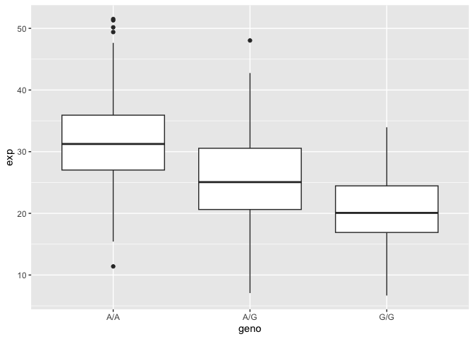

# Class 12 Homework
Saket Chodavarapu (PID: A18582086)

- [Q13](#q13)
- [Q14: Boxplot](#q14-boxplot)

## Q13

Read in the file.

``` r
data <- read.table("https://bioboot.github.io/bimm143_W26/class-material/rs8067378_ENSG00000172057.6.txt")

head(data)
```

       sample geno      exp
    1 HG00367  A/G 28.96038
    2 NA20768  A/G 20.24449
    3 HG00361  A/A 31.32628
    4 HG00135  A/A 34.11169
    5 NA18870  G/G 18.25141
    6 NA11993  A/A 32.89721

``` r
summary(data)
```

        sample              geno                exp        
     Length:462         Length:462         Min.   : 6.675  
     Class :character   Class :character   1st Qu.:20.004  
     Mode  :character   Mode  :character   Median :25.116  
                                           Mean   :25.640  
                                           3rd Qu.:30.779  
                                           Max.   :51.518  

``` r
table(data$geno)
```


    A/A A/G G/G 
    108 233 121 

> Q13: Read this file into R and determine the sample size for each
> genotype and their corresponding median expression levels for each of
> these genotypes.

The sample size for A/A is 108, A/G is 233, and G/G is 121.

``` r
library(dplyr)
```


    Attaching package: 'dplyr'

    The following objects are masked from 'package:stats':

        filter, lag

    The following objects are masked from 'package:base':

        intersect, setdiff, setequal, union

``` r
data_aa <- data %>% filter(geno=="A/A")
summary(data_aa)
```

        sample              geno                exp       
     Length:108         Length:108         Min.   :11.40  
     Class :character   Class :character   1st Qu.:27.02  
     Mode  :character   Mode  :character   Median :31.25  
                                           Mean   :31.82  
                                           3rd Qu.:35.92  
                                           Max.   :51.52  

``` r
data_ag <- data %>% filter(geno=="A/G")
summary(data_ag)
```

        sample              geno                exp        
     Length:233         Length:233         Min.   : 7.075  
     Class :character   Class :character   1st Qu.:20.626  
     Mode  :character   Mode  :character   Median :25.065  
                                           Mean   :25.397  
                                           3rd Qu.:30.552  
                                           Max.   :48.034  

``` r
data_gg <- data %>% filter(geno=="G/G")
summary(data_gg)
```

        sample              geno                exp        
     Length:121         Length:121         Min.   : 6.675  
     Class :character   Class :character   1st Qu.:16.903  
     Mode  :character   Mode  :character   Median :20.074  
                                           Mean   :20.594  
                                           3rd Qu.:24.457  
                                           Max.   :33.956  

The median expression levels for A/A is 31.25, A/G is 25.065, and G/G is
20.074.

## Q14: Boxplot

> Q14: Generate a boxplot with a box per genotype, what could you infer
> from the relative expression value between A/A and G/G displayed in
> this plot? Does the SNP effect the expression of ORMDL3?

``` r
library(ggplot2)

ggplot(data, aes(x=geno, y=exp)) +
  geom_boxplot()
```



A/A seems to have a higher level of expression than G/G. The SNP does
affect the expression of ORMDL3, based on visual observation of the
boxplot. A/A has a higher min, Q1, median, Q3, and max than those of
G/G. Also, A/A’s Q1 is greater than G/G’s Q3.
