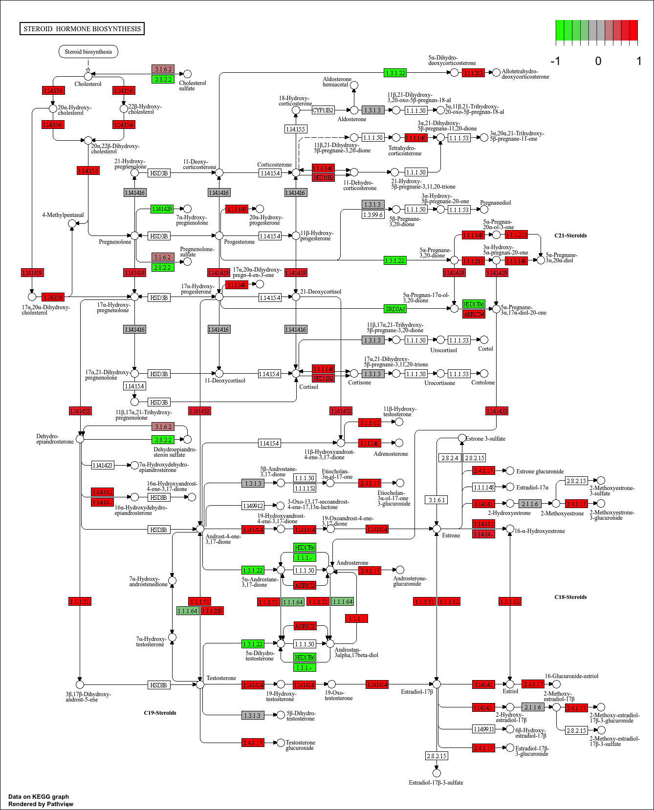
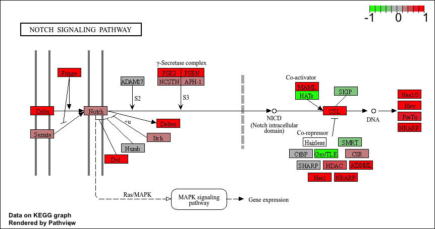
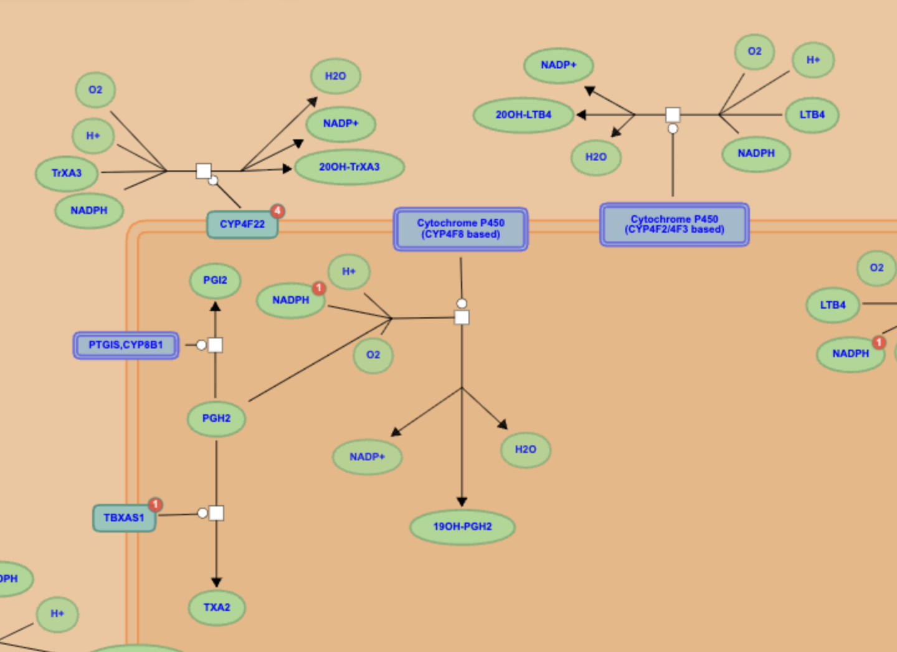

## Background

The data for today's mini-project comes from a knock-down study of an important HOX gene.

## Data Import

```{r}
countData <- read.csv("GSE37704_featurecounts.csv", row.names = 1)
colData <- read.csv("GSE37704_metadata.csv", row.names = 1)
```

Have a wee peek at these:

```{r}
colData
```

```{r}
head(countData)
```

### Clean up (data tidying)

We need to remove the funny "length" column from our `countData` to make the columns match the rows in `colData`.

```{r}
countData <- countData[, -1]
```

Check match of `colData` and `countData`

```{r}
rownames(colData) == colnames(countData)
```

```{r}
head(countData)
```

### Remove zero count genes

```{r}
to.keep <- rowSums(countData) > 0
countData <- countData[to.keep,]
```

## DESeq Analysis

```{r, message=FALSE}
library(DESeq2)
```

### Setting up the DESeq object

```{r}
dds <- DESeqDataSetFromMatrix(countData = countData,
                              colData = colData,
                              design = ~condition)
```

### Running DESeq

```{r}
dds <- DESeq(dds)
```

### Getting results

```{r}
res <- results(dds)
head(res)
```

## Volcano Plot

A plot of log2 fold change vs -log of Adjusted P-value.

```{r}
library(ggplot2)

ggplot(res) +
  aes(log2FoldChange, -log(padj)) +
  geom_point()
```

Add color.

```{r}
# Make a color vector for all genes
mycols <- rep("gray", nrow(res) )

# Color blue the genes with fold change above 2
mycols[ abs(res$log2FoldChange) > 2 ] <- "blue"

# Color gray those with adjusted p-value more than 0.01
mycols[ res$padj > 0.01 ] <- "gray"

ggplot(res) +
  aes(log2FoldChange,
      -log(padj)) +
  geom_point(col=mycols) +
  xlab("Log2(FoldChange)") +
  ylab("-Log(P-value)") +
  geom_vline(xintercept = c(-2,2)) +
  geom_hline(yintercept = 0.01)
```

## Add Annotation

```{r}
library(AnnotationDbi)
library(org.Hs.eg.db)
```

```{r}
res$symbol <- mapIds(org.Hs.eg.db,
                     keys = rownames(res), # Our ids
                     keytype = "ENSEMBL", # Their format
                     column = "SYMBOL") # What I want to translate to
res$entrez <- mapIds(org.Hs.eg.db,
                     keys = rownames(res),
                     keytype = "ENSEMBL",
                     column = "ENTREZID")
```

```{r}
head(res)
```

```{r}
write.csv(res, file="results_annotated.csv")
```

## Pathway Analysis

```{r, message=FALSE}
library(gage)
library(gageData)
library(pathview)

data(kegg.sets.hs)
data(sigmet.idx.hs)

# Focus on signaling and metabolic pathways only
kegg.sets.hs = kegg.sets.hs[sigmet.idx.hs]

# Examine the first 3 pathways
head(kegg.sets.hs, 3)
```

### KEGG

```{r}
foldchanges <- res$log2FoldChange
names(foldchanges) <- res$entrez
head(foldchanges)
```

```{r}
keggres <- gage(foldchanges, gsets=kegg.sets.hs)
```

```{r}
attributes(keggres)
```

```{r}
head(keggres$less)
```

```{r}
pathview(gene.data=foldchanges, pathway.id="hsa04110")
```


```{r}
## Focus on top 5 upregulated pathways here for demo purposes only
keggrespathways <- rownames(keggres$greater)[1:5]

# Extract the 8 character long IDs part of each string
keggresids = substr(keggrespathways, start=1, stop=8)
keggresids
```

```{r}
pathview(gene.data=foldchanges, pathway.id=keggresids, species="hsa")
```






### GO

```{r}
data(go.sets.hs)
data(go.subs.hs)

# Focus on Biological Process subset of GO
gobpsets = go.sets.hs[go.subs.hs$BP]

gobpres = gage(foldchanges, gsets=gobpsets)

lapply(gobpres, head)
```

### Reactome

```{r}
sig_genes <- res[res$padj <= 0.05 & !is.na(res$padj), "symbol"]
print(paste("Total number of significant genes:", length(sig_genes)))
```

```{r}
write.table(sig_genes, file="significant_genes.txt", row.names=FALSE, col.names=FALSE, quote=FALSE)
```

> Q: What pathway has the most significant “Entities p-value”? Do the most significant pathways listed match your previous KEGG results? What factors could cause differences between the two methods?

The pathway with the most significant Entities p-value is the mitotic cell cycle. The most significant pathways are mostly mitosis-related, which matches the KEGG results. However, some of the other KEGG results are not found in the significant pathways.




