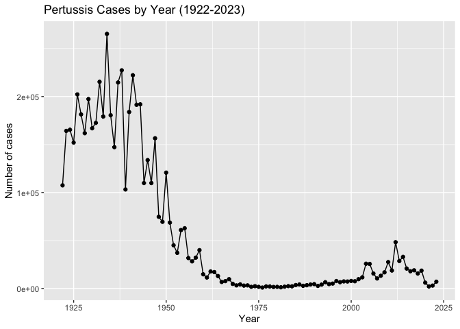
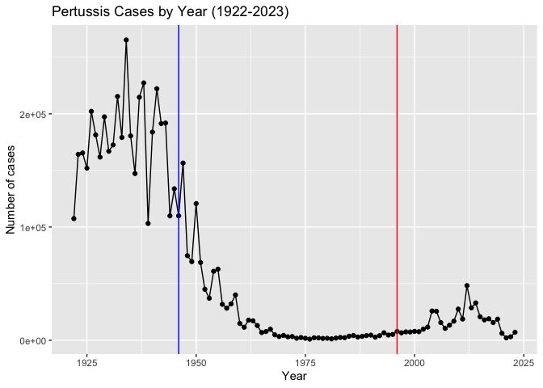
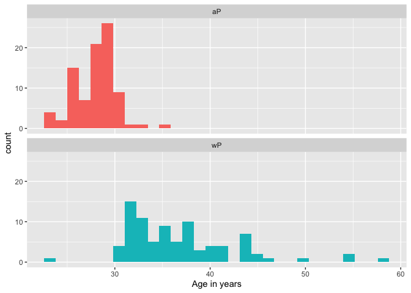
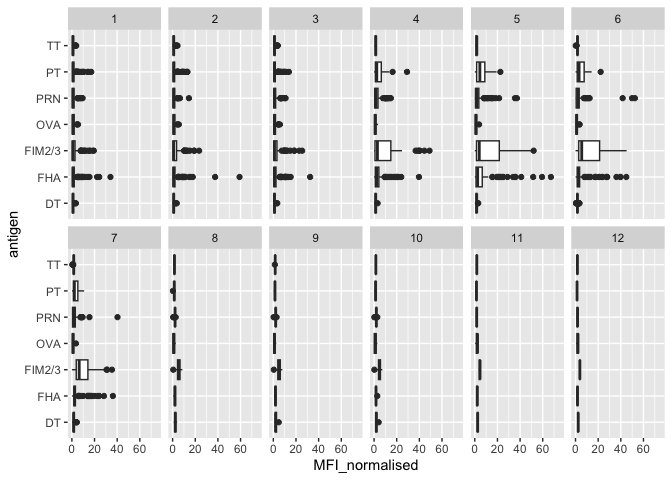
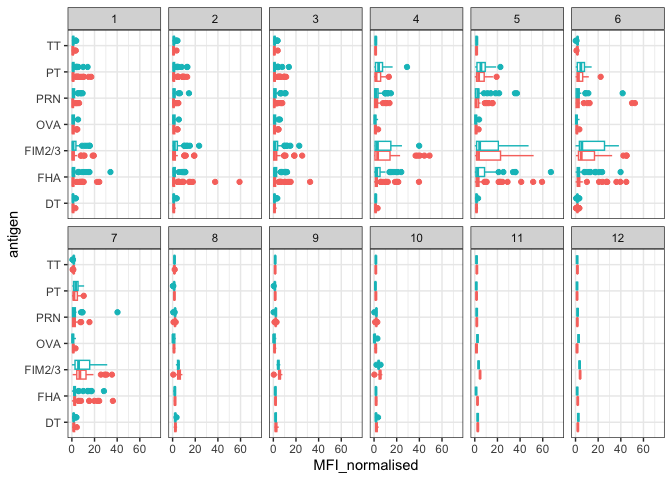
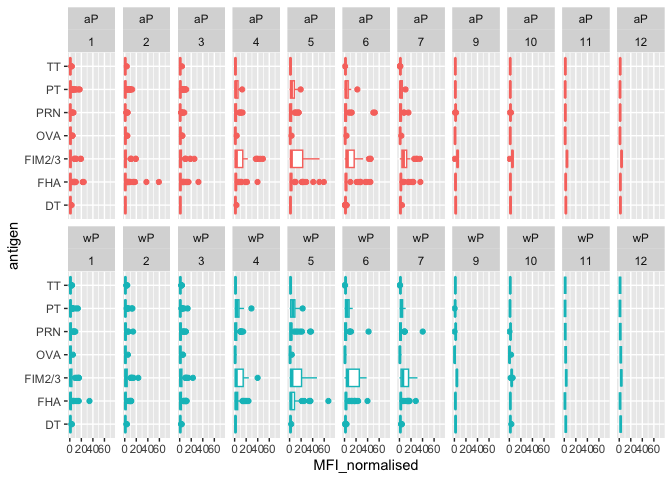
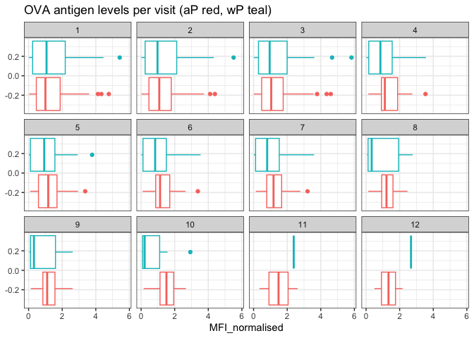
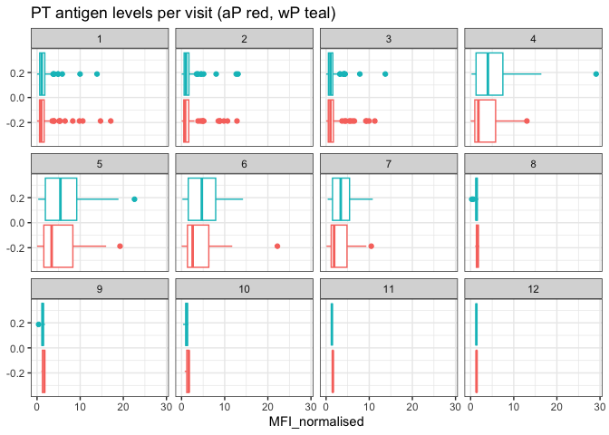
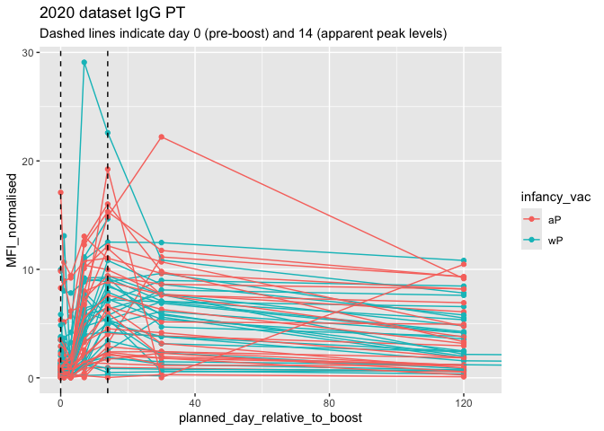
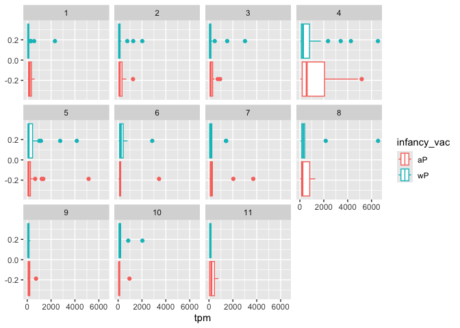

# Class 18: Investigating Pertussis Resurgence
Saket Chodavarapu (PID: A18582086)

- [Investigating pertussis cases by
  year](#investigating-pertussis-cases-by-year)
- [A tale of two vaccines (wP & aP)](#a-tale-of-two-vaccines-wp--ap)
- [Exploring CMI-PB data](#exploring-cmi-pb-data)
  - [Side-Note: Working with dates](#side-note-working-with-dates)
  - [Joining multiple tables](#joining-multiple-tables)
- [Examine IgG Ab titer levels](#examine-igg-ab-titer-levels)
- [Obtaining CMI-PB RNASeq data](#obtaining-cmi-pb-rnaseq-data)

## Investigating pertussis cases by year

> Q1. With the help of the R “addin” package datapasta assign the CDC
> pertussis case number data to a data frame called `cdc` and use
> **ggplot** to make a plot of cases numbers over time.

``` r
library(datapasta)

cdc <- data.table::data.table(
                          Year = c(1922L,
                                   1923L,1924L,1925L,1926L,1927L,1928L,
                                   1929L,1930L,1931L,1932L,1933L,1934L,1935L,
                                   1936L,1937L,1938L,1939L,1940L,1941L,
                                   1942L,1943L,1944L,1945L,1946L,1947L,1948L,
                                   1949L,1950L,1951L,1952L,1953L,1954L,
                                   1955L,1956L,1957L,1958L,1959L,1960L,
                                   1961L,1962L,1963L,1964L,1965L,1966L,1967L,
                                   1968L,1969L,1970L,1971L,1972L,1973L,
                                   1974L,1975L,1976L,1977L,1978L,1979L,1980L,
                                   1981L,1982L,1983L,1984L,1985L,1986L,
                                   1987L,1988L,1989L,1990L,1991L,1992L,1993L,
                                   1994L,1995L,1996L,1997L,1998L,1999L,
                                   2000L,2001L,2002L,2003L,2004L,2005L,
                                   2006L,2007L,2008L,2009L,2010L,2011L,2012L,
                                   2013L,2014L,2015L,2016L,2017L,2018L,
                                   2019L,2020L,2021L,2022L,2023L),
  No_Reported_Pertussis_Cases = c(107473,
                                   164191,165418,152003,202210,181411,
                                   161799,197371,166914,172559,215343,179135,
                                   265269,180518,147237,214652,227319,103188,
                                   183866,222202,191383,191890,109873,
                                   133792,109860,156517,74715,69479,120718,
                                   68687,45030,37129,60886,62786,31732,28295,
                                   32148,40005,14809,11468,17749,17135,
                                   13005,6799,7717,9718,4810,3285,4249,
                                   3036,3287,1759,2402,1738,1010,2177,2063,
                                   1623,1730,1248,1895,2463,2276,3589,
                                   4195,2823,3450,4157,4570,2719,4083,6586,
                                   4617,5137,7796,6564,7405,7298,7867,
                                   7580,9771,11647,25827,25616,15632,10454,
                                   13278,16858,27550,18719,48277,28639,
                                   32971,20762,17972,18975,15609,18617,6124,
                                   2116,3044,7063)
)

head(cdc)
```

        Year No_Reported_Pertussis_Cases
       <int>                       <num>
    1:  1922                      107473
    2:  1923                      164191
    3:  1924                      165418
    4:  1925                      152003
    5:  1926                      202210
    6:  1927                      181411

``` r
library(ggplot2)

ggplot(cdc) +
  aes(Year, No_Reported_Pertussis_Cases) +
  geom_point() +
  geom_line() +
  labs(title="Pertussis Cases by Year (1922-2023)", y="Number of cases")
```



## A tale of two vaccines (wP & aP)

> Q2. Using the ggplot `geom_vline()` function add lines to your
> previous plot for the 1946 introduction of the wP vaccine and the 1996
> switch to aP vaccine (see example in the hint below). What do you
> notice?

``` r
ggplot(cdc) +
  aes(Year, No_Reported_Pertussis_Cases) +
  geom_point() +
  geom_line() +
  labs(title="Pertussis Cases by Year (1922-2023)", y="Number of cases") +
  geom_vline(xintercept=1946, col="blue") +
  geom_vline(xintercept=1996, col="red")
```



After the 1946 introduction of the wP vaccine, the number of cases
drastically decreased. After the 1996 switch to the aP vaccine, there
was an increase in cases but the number started to decrease again.

> Q3. Describe what happened after the introduction of the aP vaccine?
> Do you have a possible explanation for the observed trend?

After the introduction of the aP vaccine, the number of cases began to
rise again, but then dropped back down. A possible explanation is that
people were hesitant to take the newer vaccine.

## Exploring CMI-PB data

``` r
library(jsonlite)
```

``` r
subject <- read_json("https://www.cmi-pb.org/api/subject", simplifyVector = TRUE) 

head(subject, 3)
```

      subject_id infancy_vac biological_sex              ethnicity  race
    1          1          wP         Female Not Hispanic or Latino White
    2          2          wP         Female Not Hispanic or Latino White
    3          3          wP         Female                Unknown White
      year_of_birth date_of_boost      dataset
    1    1986-01-01    2016-09-12 2020_dataset
    2    1968-01-01    2019-01-28 2020_dataset
    3    1983-01-01    2016-10-10 2020_dataset

> Q4. How many aP and wP infancy vaccinated subjects are in the dataset?

``` r
table(subject$infancy_vac)
```


    aP wP 
    87 85 

There are 87 aP and 85 wP infancy vaccinated subjects in the dataset.

> Q5. How many Male and Female subjects/patients are in the dataset?

``` r
table(subject$biological_sex)
```


    Female   Male 
       112     60 

There are 60 male and 112 female subjects in the dataset.

> Q6. What is the breakdown of race and biological sex (e.g. number of
> Asian females, White males etc…)?

``` r
table(subject$race, subject$biological_sex)
```

                                               
                                                Female Male
      American Indian/Alaska Native                  0    1
      Asian                                         32   12
      Black or African American                      2    3
      More Than One Race                            15    4
      Native Hawaiian or Other Pacific Islander      1    1
      Unknown or Not Reported                       14    7
      White                                         48   32

The breakdown of race and biological sex is listed in the table.

### Side-Note: Working with dates

``` r
library(lubridate)
```


    Attaching package: 'lubridate'

    The following objects are masked from 'package:base':

        date, intersect, setdiff, union

``` r
today()
```

    [1] "2026-03-13"

``` r
today() - ymd("2000-01-01")
```

    Time difference of 9568 days

``` r
time_length( today() - ymd("2000-01-01"),  "years")
```

    [1] 26.19576

> Q7. Using this approach determine (i) the average age of wP
> individuals, (ii) the average age of aP individuals; and (iii) are
> they significantly different?

``` r
subject$age <- today() - ymd(subject$year_of_birth)

library(dplyr)
```


    Attaching package: 'dplyr'

    The following objects are masked from 'package:stats':

        filter, lag

    The following objects are masked from 'package:base':

        intersect, setdiff, setequal, union

``` r
wP <- subject %>% filter(infancy_vac == "wP")

round( summary( time_length( wP$age, "years" ) ) )
```

       Min. 1st Qu.  Median    Mean 3rd Qu.    Max. 
         23      33      35      37      40      58 

The average age of wP individuals is 37 years.

``` r
aP <- subject %>% filter(infancy_vac == "aP")

round( summary( time_length( aP$age, "years" ) ) )
```

       Min. 1st Qu.  Median    Mean 3rd Qu.    Max. 
         23      27      28      28      29      35 

The average age of aP individuals is 28 years.

``` r
t.test(time_length(wP$age, "years"), time_length(aP$age, "years"))
```


        Welch Two Sample t-test

    data:  time_length(wP$age, "years") and time_length(aP$age, "years")
    t = 12.918, df = 104.03, p-value < 2.2e-16
    alternative hypothesis: true difference in means is not equal to 0
    95 percent confidence interval:
      7.407351 10.094058
    sample estimates:
    mean of x mean of y 
     36.84181  28.09110 

The p-value for the t-test is less than 2.2e-16, which means there is a
significant statistical difference between the average age of wP
individuals and aP individuals.

> Q8. Determine the age of all individuals at time of boost?

``` r
days <- ymd(subject$date_of_boost) - ymd(subject$year_of_birth)
age_at_boost <- time_length(days, "year")
head(age_at_boost)
```

    [1] 30.69678 51.07461 33.77413 28.65982 25.65914 28.77481

The age of all individuals at time of boost is stored in the variable
age_at_boost.

> Q9. With the help of a faceted boxplot or histogram (see below), do
> you think these two groups are significantly different?

``` r
ggplot(subject) +
  aes(time_length(age, "year"),
      fill=as.factor(infancy_vac)) +
  geom_histogram(show.legend=FALSE) +
  facet_wrap(vars(infancy_vac), nrow=2) +
  xlab("Age in years")
```

    `stat_bin()` using `bins = 30`. Pick better value `binwidth`.



Based on the two histograms, the two groups appear to be significantly
different.

### Joining multiple tables

``` r
# Complete the API URLs...
specimen <- read_json("https://www.cmi-pb.org/api/specimen", simplifyVector = TRUE) 
titer <- read_json("https://www.cmi-pb.org/api/plasma_ab_titer", simplifyVector = TRUE)
```

> Q9. Complete the code to join `specimen` and `subject` tables to make
> a new merged data frame containing all specimen records along with
> their associated subject details:

``` r
meta <- full_join(specimen, subject)
```

    Joining with `by = join_by(subject_id)`

``` r
dim(meta)
```

    [1] 1504   14

``` r
head(meta)
```

      specimen_id subject_id actual_day_relative_to_boost
    1           1          1                           -3
    2           2          1                            1
    3           3          1                            3
    4           4          1                            7
    5           5          1                           11
    6           6          1                           32
      planned_day_relative_to_boost specimen_type visit infancy_vac biological_sex
    1                             0         Blood     1          wP         Female
    2                             1         Blood     2          wP         Female
    3                             3         Blood     3          wP         Female
    4                             7         Blood     4          wP         Female
    5                            14         Blood     5          wP         Female
    6                            30         Blood     6          wP         Female
                   ethnicity  race year_of_birth date_of_boost      dataset
    1 Not Hispanic or Latino White    1986-01-01    2016-09-12 2020_dataset
    2 Not Hispanic or Latino White    1986-01-01    2016-09-12 2020_dataset
    3 Not Hispanic or Latino White    1986-01-01    2016-09-12 2020_dataset
    4 Not Hispanic or Latino White    1986-01-01    2016-09-12 2020_dataset
    5 Not Hispanic or Latino White    1986-01-01    2016-09-12 2020_dataset
    6 Not Hispanic or Latino White    1986-01-01    2016-09-12 2020_dataset
             age
    1 14681 days
    2 14681 days
    3 14681 days
    4 14681 days
    5 14681 days
    6 14681 days

> Q10. Now using the same procedure join `meta` with `titer` data so we
> can further analyze this data in terms of time of visit aP/wP,
> male/female etc.

``` r
abdata <- inner_join(titer, meta)
```

    Joining with `by = join_by(specimen_id)`

``` r
dim(abdata)
```

    [1] 52576    21

> Q11. How many specimens (i.e. entries in `abdata`) do we have for each
> `isotype`?

``` r
table(abdata$isotype)
```


      IgE   IgG  IgG1  IgG2  IgG3  IgG4 
     6698  5389 10117 10124 10124 10124 

> Q12. What are the different `$dataset` values in `abdata` and what do
> you notice about the number of rows for the most “recent” dataset?

``` r
table(abdata$dataset)
```


    2020_dataset 2021_dataset 2022_dataset 2023_dataset 
           31520         8085         7301         5670 

The number of rows for the most recent dataset is lower than all the
other datasets.

## Examine IgG Ab titer levels

``` r
igg <- abdata %>% filter(isotype == "IgG")
head(igg)
```

      specimen_id isotype is_antigen_specific antigen        MFI MFI_normalised
    1           1     IgG                TRUE      PT   68.56614       3.736992
    2           1     IgG                TRUE     PRN  332.12718       2.602350
    3           1     IgG                TRUE     FHA 1887.12263      34.050956
    4          19     IgG                TRUE      PT   20.11607       1.096366
    5          19     IgG                TRUE     PRN  976.67419       7.652635
    6          19     IgG                TRUE     FHA   60.76626       1.096457
       unit lower_limit_of_detection subject_id actual_day_relative_to_boost
    1 IU/ML                 0.530000          1                           -3
    2 IU/ML                 6.205949          1                           -3
    3 IU/ML                 4.679535          1                           -3
    4 IU/ML                 0.530000          3                           -3
    5 IU/ML                 6.205949          3                           -3
    6 IU/ML                 4.679535          3                           -3
      planned_day_relative_to_boost specimen_type visit infancy_vac biological_sex
    1                             0         Blood     1          wP         Female
    2                             0         Blood     1          wP         Female
    3                             0         Blood     1          wP         Female
    4                             0         Blood     1          wP         Female
    5                             0         Blood     1          wP         Female
    6                             0         Blood     1          wP         Female
                   ethnicity  race year_of_birth date_of_boost      dataset
    1 Not Hispanic or Latino White    1986-01-01    2016-09-12 2020_dataset
    2 Not Hispanic or Latino White    1986-01-01    2016-09-12 2020_dataset
    3 Not Hispanic or Latino White    1986-01-01    2016-09-12 2020_dataset
    4                Unknown White    1983-01-01    2016-10-10 2020_dataset
    5                Unknown White    1983-01-01    2016-10-10 2020_dataset
    6                Unknown White    1983-01-01    2016-10-10 2020_dataset
             age
    1 14681 days
    2 14681 days
    3 14681 days
    4 15777 days
    5 15777 days
    6 15777 days

> Q13. Complete the following code to make a summary boxplot of Ab titer
> levels (MFI) for all antigens:

``` r
ggplot(igg) +
  aes(MFI_normalised, antigen) +
  geom_boxplot() + 
    xlim(0,75) +
  facet_wrap(vars(visit), nrow=2)
```

    Warning: Removed 5 rows containing non-finite outside the scale range
    (`stat_boxplot()`).



> Q14. What antigens show differences in the level of IgG antibody
> titers recognizing them over time? Why these and not others?

The antigens PT, PRN, FIM2/3, and FHA show differences in the level of
IgG antibody titers recognizing them over time. These antigens show
differences because they trigger a secondary immune response, whereas
other antigens do not.

``` r
ggplot(igg) +
  aes(MFI_normalised, antigen, col=infancy_vac ) +
  geom_boxplot(show.legend = FALSE) + 
  facet_wrap(vars(visit), nrow=2) +
  xlim(0,75) +
  theme_bw()
```

    Warning: Removed 5 rows containing non-finite outside the scale range
    (`stat_boxplot()`).



``` r
igg %>% filter(visit != 8) %>%
ggplot() +
  aes(MFI_normalised, antigen, col=infancy_vac ) +
  geom_boxplot(show.legend = FALSE) + 
  xlim(0,75) +
  facet_wrap(vars(infancy_vac, visit), nrow=2)
```

    Warning: Removed 5 rows containing non-finite outside the scale range
    (`stat_boxplot()`).



> Q15. Filter to pull out only two specific antigens for analysis and
> create a boxplot for each. You can chose any you like. Below I picked
> a “control” antigen (“OVA”, that is not in our vaccines) and a clear
> antigen of interest (“PT”, Pertussis Toxin, one of the key virulence
> factors produced by the bacterium B. pertussis).

``` r
filter(igg, antigen=="OVA") %>%
  ggplot() +
  aes(MFI_normalised, col=infancy_vac) +
  geom_boxplot(show.legend = FALSE) +
  facet_wrap(vars(visit)) +
  theme_bw() +
  labs(title="OVA antigen levels per visit (aP red, wP teal)")
```



``` r
filter(igg, antigen=="PT") %>%
  ggplot() +
  aes(MFI_normalised, col=infancy_vac) +
  geom_boxplot(show.legend = FALSE) +
  facet_wrap(vars(visit)) +
  theme_bw() +
  labs(title="PT antigen levels per visit (aP red, wP teal)")
```



> Q16. What do you notice about these two antigens time courses and the
> PT data in particular?

OVA seems to steadily decrease over time for both aP and wP. PT
initially increases until visit 5, and then decreases for both aP and
wP. OVA levels are generally higher than PT levels for both aP and wP
patients.

> Q17. Do you see any clear difference in aP vs. wP responses?

For both of these antigens, there is no clear difference between aP and
wP responses.

``` r
abdata.21 <- abdata %>% filter(dataset == "2021_dataset")

abdata.21 %>% 
  filter(isotype == "IgG",  antigen == "PT") %>%
  ggplot() +
    aes(x=planned_day_relative_to_boost,
        y=MFI_normalised,
        col=infancy_vac,
        group=subject_id) +
    geom_point() +
    geom_line() +
    geom_vline(xintercept=0, linetype="dashed") +
    geom_vline(xintercept=14, linetype="dashed") +
  labs(title="2021 dataset IgG PT",
       subtitle = "Dashed lines indicate day 0 (pre-boost) and 14 (apparent peak levels)")
```


> Q18. Does this trend look similar for the 2020 dataset?

``` r
abdata.20 <- abdata %>% filter(dataset == "2020_dataset")

abdata.20 %>% 
  filter(isotype == "IgG",  antigen == "PT") %>%
  ggplot() +
    aes(x=planned_day_relative_to_boost,
        y=MFI_normalised,
        col=infancy_vac,
        group=subject_id) +
    geom_point() +
    geom_line() +
    geom_vline(xintercept=0, linetype="dashed") +
    geom_vline(xintercept=14, linetype="dashed") +
    coord_cartesian(xlim = c(0, 125)) +
  labs(title="2020 dataset IgG PT",
       subtitle = "Dashed lines indicate day 0 (pre-boost) and 14 (apparent peak levels)")
```



The 2021 trend looks fairly similar to the 2020 dataset. Both show an
increase from day 0 to day 14, and then a slight decrease until day 120.

## Obtaining CMI-PB RNASeq data

``` r
url <- "https://www.cmi-pb.org/api/v2/rnaseq?versioned_ensembl_gene_id=eq.ENSG00000211896.7"

rna <- read_json(url, simplifyVector = TRUE) 
```

``` r
#meta <- inner_join(specimen, subject)
ssrna <- inner_join(rna, meta)
```

    Joining with `by = join_by(specimen_id)`

> Q19. Make a plot of the time course of gene expression for IGHG1 gene
> (i.e. a plot of `visit` vs. `tpm`).

``` r
ggplot(ssrna) +
  aes(visit, tpm, group=subject_id) +
  geom_point() +
  geom_line(alpha=0.2)
```


> Q20.: What do you notice about the expression of this gene (i.e. when
> is it at it’s maximum level)?

Typically, the maximum expression of this gene occurs during visit 4.

> Q21. Does this pattern in time match the trend of antibody titer data?
> If not, why not?

The pattern almost matches the trend of antibody titer data, except
antigen levels peak around visit 5 while antibody levels peak around
visit 4. As the cell produces more antibodies, the antigen levels
decrease, which is what we observe in the antigen level plots.

``` r
ggplot(ssrna) +
  aes(tpm, col=infancy_vac) +
  geom_boxplot() +
  facet_wrap(vars(visit))
```



``` r
ssrna %>%  
  filter(visit==4) %>% 
  ggplot() +
    aes(tpm, col=infancy_vac) + geom_density() + 
    geom_rug() 
```


