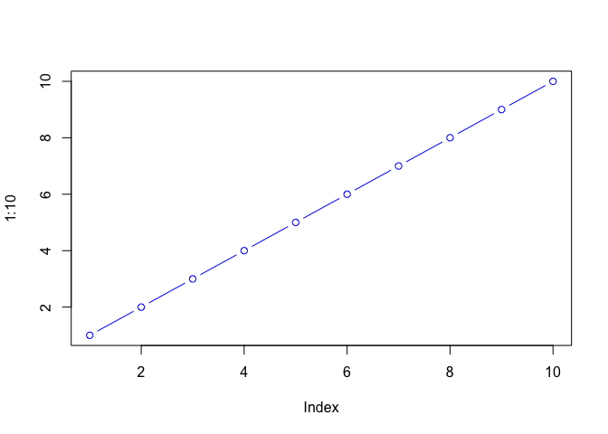

# Class6: R Functions
Saket Chodavarapu (PID: A18582086)

- [Background](#background)
- [A first function](#a-first-function)
- [A second function](#a-second-function)

## Background

Functions are at the heart of using R. Everything we do involves calling
and using functions (from data input, analysis to results output).

All functions in R have at least 3 things:

- A **name**, the thing we use to call the function.
- One or more input **arguments** that are comma-separated
- The **body**, lines of code between curly brackets { } that does the
  work of the function.

## A first function

Let’s write a silly wee function to add some numbers:

``` r
add <- function(x) {
  x + 1
}
```

Let’s try it out

``` r
add(100)
```

    [1] 101

Will this work

``` r
add( c(100, 200, 300) )
```

    [1] 101 201 301

Modify to be more useful and add more than just 1

``` r
add <- function(x, y=1) {
  x + y
}
```

``` r
add(100, 10)
```

    [1] 110

Will this work?

``` r
add(100)
```

    [1] 101

``` r
plot(1:10, col="blue", typ="b")
```



``` r
log(10, base=10)
```

    [1] 1

> **Note**: Input arguments can be either **required** or **optional**.
> The latter has a fall-back default that is specified in the function
> code with an equals sign.

``` r
# add(x=100, y=200, z=300)
```

## A second function

All functions in R look like this:

    name <- function(arg) {
      body
    }

The `sample()` function in R …

``` r
sample(1:10, size = 4)
```

    [1] 2 8 1 5

> Q: Return 12 numbers picked randomly from the input 1:10

``` r
sample(1:10, size = 12, replace = TRUE)
```

     [1]  7  6 10  8  1  9 10  2 10  1  4  4

> Q. Write the code to generate a random 12-nucleotide DNA sequence.

``` r
# sequence <- sample(c("A", "T", "C", "G"), size=12, replace=T)
# paste(sequence, collapse="")

bases <- c("A", "C", "G", "T")
sample(bases, size=12, replace=TRUE)
```

     [1] "G" "T" "A" "A" "C" "A" "C" "A" "C" "A" "C" "G"

> Q. Write a first version function called `generate_dna()` that
> generates a user specified length `n` random DNA sequence.

``` r
generate_dna <- function(n=6) {
  bases <- c("A", "C", "G", "T")
  sample(bases, size=n, replace=TRUE)
}
```

``` r
generate_dna(100)
```

      [1] "T" "A" "G" "C" "T" "C" "A" "C" "G" "A" "G" "G" "A" "A" "A" "A" "G" "G"
     [19] "G" "C" "C" "A" "G" "C" "C" "T" "T" "A" "T" "C" "A" "A" "C" "C" "A" "T"
     [37] "A" "T" "T" "T" "A" "A" "T" "G" "G" "A" "C" "C" "A" "G" "T" "A" "G" "G"
     [55] "T" "C" "G" "T" "G" "A" "G" "C" "T" "A" "T" "C" "G" "T" "T" "G" "T" "T"
     [73] "T" "A" "T" "A" "T" "A" "C" "T" "A" "T" "G" "T" "G" "G" "A" "C" "A" "T"
     [91] "T" "T" "A" "C" "C" "G" "T" "A" "G" "T"

> Q. Modify your fuunction to return a FASTA like sequence. Rather than
> \[1\] “T” “A” “G” “G” “C” we want “TAGGC”

``` r
generate_dna <- function(n=6) {
  bases <- c("A", "C", "G", "T")
  ans <- paste(sample(bases, size=n, replace=TRUE), collapse="")
  return(ans)
  x <- "poopoopants"
  x
}
```

``` r
generate_dna(12)
```

    [1] "GGGGGTGGATCC"

> Q. give the user an option to return FASTA format output sequence or
> standard multi-element vector format?

``` r
generate_dna <- function(n=6, fasta=TRUE) {
  bases <- c("A", "C", "G", "T")
  ans <- sample(bases, size=n, replace=TRUE)
  
  if(fasta) {
    ans <- paste(ans, collapse="")
    cat("Hello...")
  }
  else {
    cat("...is it me you are looking for...")
  }
  
  return(ans)
}
```

``` r
generate_dna(10)
```

    Hello...

    [1] "AGGAAGCGCT"

``` r
generate_dna(10, fasta=F)
```

    ...is it me you are looking for...

     [1] "T" "C" "A" "A" "T" "A" "C" "G" "T" "T"

> Q. Write a function called `generate_protein()` that generates a user
> specified length protein sequence in FASTA-like format.

``` r
generate_protein <- function(n) {
  aa_codes <- c(
  "A","R","N","D","C",
  "E","Q","G","H","I",
  "L","K","M","F","P",
  "S","T","W","Y","V"
  )
  ans <- sample(aa_codes, size=n, replace=T)
  ans <- paste(ans, collapse="")
  return(ans)
}
```

``` r
generate_protein(12)
```

    [1] "PSDRGMNCKPIR"

> Q. Use your new `generate_protein()` function to generate sequences
> between length 6 and 12 amino acids in length and check if any of
> these are unique in nature (i.e. found in the NR databse at NCBI)?

``` r
for(i in 6:12) {
  cat(">", i, "\n", sep="")
  cat(generate_protein(i), "\n")
}
```

    >6
    SVLSPR 
    >7
    GSYRMKV 
    >8
    DKQINDAY 
    >9
    PGGHIAGCF 
    >10
    GRQDVRTWCR 
    >11
    RFWTNSYAMGY 
    >12
    LRGDMPHGKTDQ 
