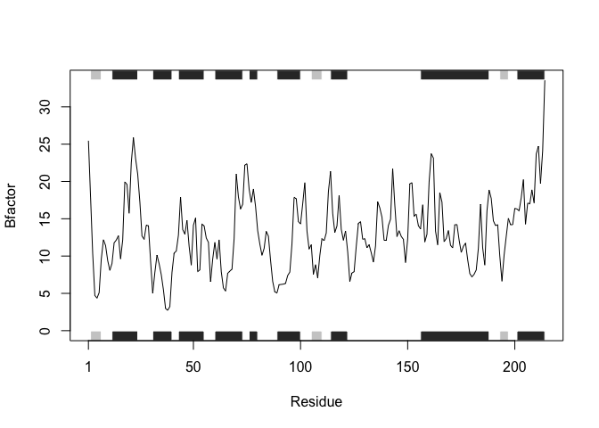

# Class6HW
Saket Chodavarapu (PID: A18582086)

## Q6. Creating a function that reads in protein PDB data and creates a plot for the protein

First we need to load the bio3d library.

``` r
library(bio3d)
```

Now we create the function that takes a protein id as input and creates
a plot of that protein.

Function info:

- inputs a String that represents the protein id
- outputs a plot to represent the protein

``` r
plot_protein <- function(id) {
  prot <- read.pdb(id) # read in the inputted id
  
  prot.chainA <- trim.pdb(prot, chain="A", elety="CA")
  prot.b <- prot.chainA$atom$b
  
  plotb3(prot.b, sse=prot.chainA, typ="l", ylab="Bfactor") # plot the graph
}
```

Let’s test the code to make sure it works.

``` r
plot_protein("4AKE")
```

      Note: Accessing on-line PDB file


``` r
plot_protein("1AKE")
```

      Note: Accessing on-line PDB file
       PDB has ALT records, taking A only, rm.alt=TRUE


``` r
plot_protein("1E4Y")
```

      Note: Accessing on-line PDB file


