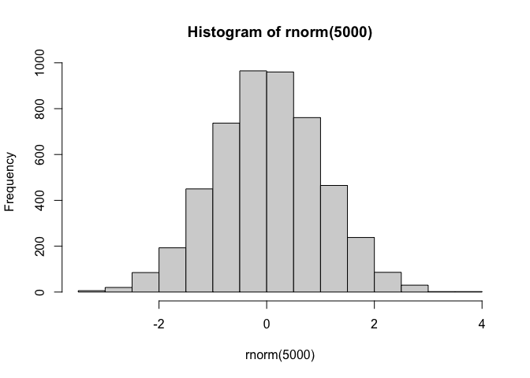
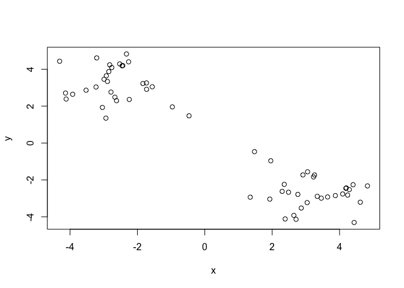
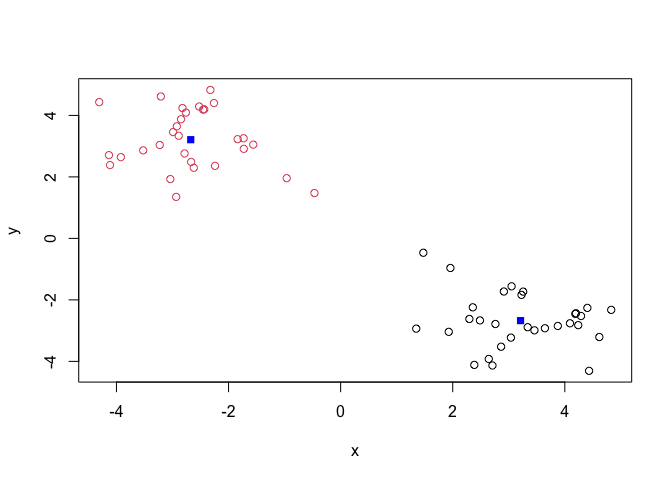
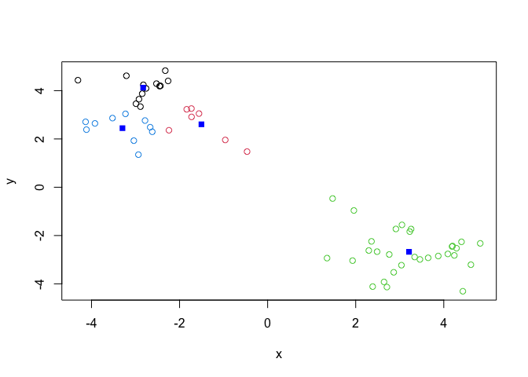
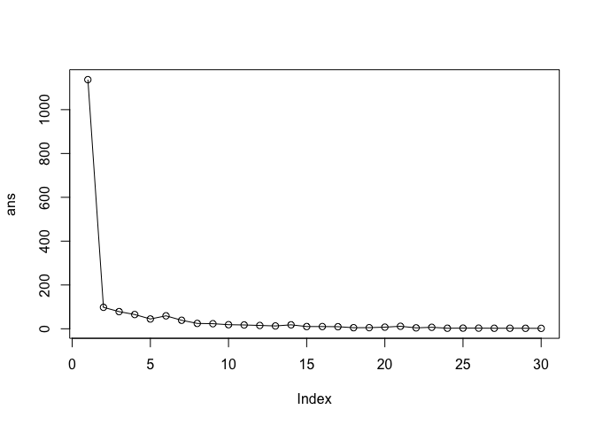
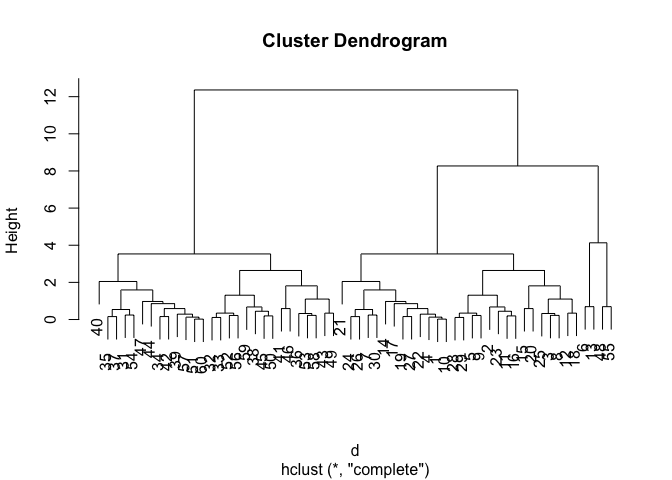
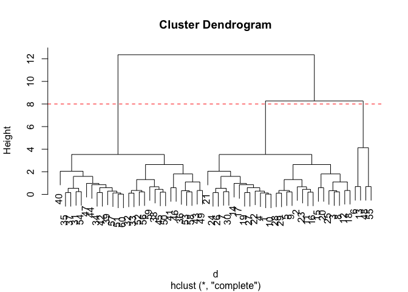

# Class 7: Machine Learning 1
Saket Chodavarapu (PID: A18582086)

## Background

Today we will begin our exploration of some important machine learning
methods, namely **clustering** and **dimensionality reduction**.

Let’s make up some input data for clustering where we know what the
natural “clusters” are.

The function `rnorm()` can be useful here.

``` r
hist(rnorm(5000))
```



> Q. Generate 30 random numbers centered at +3 and another 30 centered
> at -3.

``` r
tmp <- c(rnorm(30, mean=3),
         rnorm(30, mean=-3))

x <- cbind(x=tmp, y=rev(tmp))
plot(x)
```



## K-means clustering

The main function in “base R” for K-means clustering is called
`kmeans()`:

``` r
km <- kmeans(x, 2)
km
```

    K-means clustering with 2 clusters of sizes 30, 30

    Cluster means:
              x         y
    1  3.210155 -2.674747
    2 -2.674747  3.210155

    Clustering vector:
     [1] 1 1 1 1 1 1 1 1 1 1 1 1 1 1 1 1 1 1 1 1 1 1 1 1 1 1 1 1 1 1 2 2 2 2 2 2 2 2
    [39] 2 2 2 2 2 2 2 2 2 2 2 2 2 2 2 2 2 2 2 2 2 2

    Within cluster sum of squares by cluster:
    [1] 49.00816 49.00816
     (between_SS / total_SS =  91.4 %)

    Available components:

    [1] "cluster"      "centers"      "totss"        "withinss"     "tot.withinss"
    [6] "betweenss"    "size"         "iter"         "ifault"      

> Q. What component of the results object details the cluster sizes?

``` r
km$size
```

    [1] 30 30

> Q. What component of the results object details the cluster centers?

``` r
km$centers
```

              x         y
    1  3.210155 -2.674747
    2 -2.674747  3.210155

> Q. What component of the results object details the cluster membership
> vector (i.e. our main result of which points lie in which cluster)?

``` r
km$cluster
```

     [1] 1 1 1 1 1 1 1 1 1 1 1 1 1 1 1 1 1 1 1 1 1 1 1 1 1 1 1 1 1 1 2 2 2 2 2 2 2 2
    [39] 2 2 2 2 2 2 2 2 2 2 2 2 2 2 2 2 2 2 2 2 2 2

> Q. Plot our clustering results with points colored by cluster and also
> add the cluster centers as new points colored blue.

``` r
plot(x, col=km$cluster)
points(km$centers, col="blue", pch=15)
```



> Q. Run `kmeans()` again and this time produce 4 clusters (and call
> your result object `k4`) and make a results figure like above.

``` r
k4 <- kmeans(x, 4)

plot(x, col=k4$cluster)
points(k4$centers, col="blue", pch=15)
```



The metric

``` r
km$tot.withinss
```

    [1] 98.01633

``` r
k4$tot.withinss
```

    [1] 65.01187

> Q. Let’s try different number of K (centers) from 1 to 30 and see what
> the best result is.

``` r
ans <- NULL
for(i in 1:30) {
  ans <- c(ans, kmeans(x, centers=i)$tot.withinss)
}

ans
```

     [1] 1136.978399   98.016329   78.355238   65.011872   44.720952   59.136672
     [7]   38.845752   24.505474   23.160280   18.630273   17.445811   15.175325
    [13]   12.925237   18.058627   10.173917   10.106617    9.465913    4.941602
    [19]    5.116011    7.443619   11.420719    4.216135    6.757209    2.530618
    [25]    3.016635    2.938169    2.409564    2.502607    2.247182    1.949039

``` r
plot(ans, typ="o")
```



**Key point:** K-means will impose a clustering structure on your data
even if it is not there - it will always give you the answer you asked
for even if that answer is silly!

## Hierarchical Clustering

The main function for Hierarchical Clustering is called `hclust()`.
Unlike `kmeans()` (which does all the work for you) you can’t just pass
`hclust()` our raw input data. It needs a “distance matrix” like the one
returned by the `dist()` function.

``` r
d <- dist(x)
hc <- hclust(d)
plot(hc)
```



To extract our cluster membership vector from a `hclust()` result object
we have to “cut” our tree at a given height to yield separate
“groups”/“branches”.

``` r
plot(hc)
abline(h=8, col="red", lty=2)
```



To do this we use the `cutree()` function on our `hclust()` object:

``` r
grps <- cutree(hc, h=8)
grps
```

     [1] 1 1 1 1 1 2 1 1 1 1 1 1 2 1 1 1 1 1 1 1 1 1 1 1 1 1 1 1 1 1 3 3 3 3 3 3 3 3
    [39] 3 3 3 3 3 3 3 3 3 2 3 3 3 3 3 3 2 3 3 3 3 3

``` r
table(grps, km$cluster)
```

        
    grps  1  2
       1 28  0
       2  2  2
       3  0 28

## PCA of UK food data

Import the dataset of food consumption in the UK:

``` r
url <- "https://tinyurl.com/UK-foods"
x <- read.csv(url)
x
```

                         X England Wales Scotland N.Ireland
    1               Cheese     105   103      103        66
    2        Carcass_meat      245   227      242       267
    3          Other_meat      685   803      750       586
    4                 Fish     147   160      122        93
    5       Fats_and_oils      193   235      184       209
    6               Sugars     156   175      147       139
    7      Fresh_potatoes      720   874      566      1033
    8           Fresh_Veg      253   265      171       143
    9           Other_Veg      488   570      418       355
    10 Processed_potatoes      198   203      220       187
    11      Processed_Veg      360   365      337       334
    12        Fresh_fruit     1102  1137      957       674
    13            Cereals     1472  1582     1462      1494
    14           Beverages      57    73       53        47
    15        Soft_drinks     1374  1256     1572      1506
    16   Alcoholic_drinks      375   475      458       135
    17      Confectionery       54    64       62        41

> Q1. How many rows and columns are in your new data frame named x? What
> R functions could you use to answer this questions?

``` r
dim(x)
```

    [1] 17  5

One solution to set the row names is to do it by hand…

``` r
rownames(x) <- x[,1]
```

To remove the first column I can use the minus index trick

``` r
x <- x[,-1]
```

A better way to do this is to set the row names to the first column with
`read.csv()`

``` r
x <- read.csv(url, row.names = 1)
```

> Q2. Which approach to solving the ‘row-names problem’ mentioned above
> do you prefer and why? Is one approach more robust than another under
> certain circumstances?

The “manual” method is not great because it will delete a column every
time you run the chunk of code. It’s better to assign row names when you
read in the file.

### Spotting major differences and trends

Is difficult even in this wee 17D dataset…

``` r
barplot(as.matrix(x), beside=T, col=rainbow(nrow(x)))
```


``` r
barplot(as.matrix(x), beside=F, col=rainbow(nrow(x)))
```


### Pairs plots and heatmaps

``` r
pairs(x, col=rainbow(nrow(x)), pch=16)
```


``` r
library(pheatmap)

pheatmap( as.matrix(x) )
```


## PCA to the rescue

The main PCA function in “base R” is called `prcomp()`. This function
wants the transpose of our food data as input (i.e. the foods as columns
and the countries as rows).

``` r
pca <- prcomp( t(x) )
```

``` r
summary(pca)
```

    Importance of components:
                                PC1      PC2      PC3     PC4
    Standard deviation     324.1502 212.7478 73.87622 2.7e-14
    Proportion of Variance   0.6744   0.2905  0.03503 0.0e+00
    Cumulative Proportion    0.6744   0.9650  1.00000 1.0e+00

``` r
attributes(pca)
```

    $names
    [1] "sdev"     "rotation" "center"   "scale"    "x"       

    $class
    [1] "prcomp"

To make one of the main PCA result figures we turn to `pca$x` the scores
along our new PCs. This is called “PC plot” or “score plot” or
“Ordination plot”…

``` r
pca$x
```

                     PC1         PC2        PC3           PC4
    England   -144.99315   -2.532999 105.768945  1.612425e-14
    Wales     -240.52915 -224.646925 -56.475555  4.751043e-13
    Scotland   -91.86934  286.081786 -44.415495 -6.044349e-13
    N.Ireland  477.39164  -58.901862  -4.877895  1.145386e-13

``` r
my_cols <- c("orange", "red", "blue", "darkgreen")
```

``` r
library(ggplot2)

ggplot(pca$x) +
  aes(PC1, PC2) +
  geom_point(col=my_cols)
```


The second major result figure is called a “loadings plot” or “variable
contributions plot” or “weight plot”

``` r
ggplot(pca$rotation) +
  aes(PC1, rownames(pca$rotation)) +
  geom_col()
```


