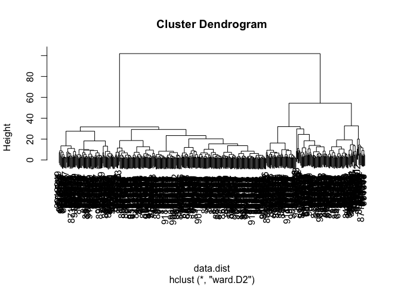
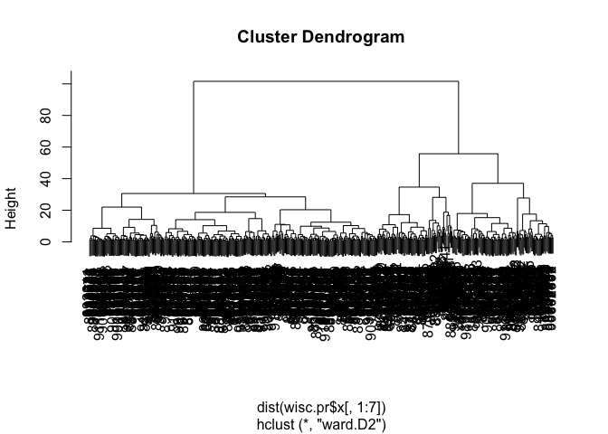
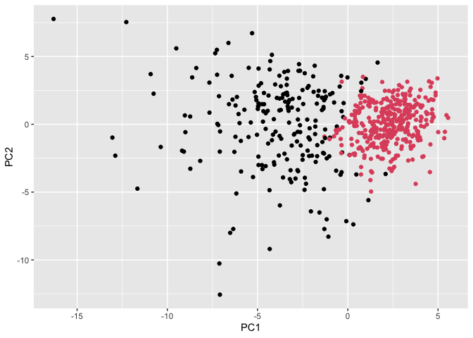

# Class 8: Mini Project
Saket Chodavarapu (PID: A18582086)

## Preparing the data

We need to read in the files.

``` r
# Save your input data file into your Project directory
fna.data <- "WisconsinCancer.csv"

# Complete the following code to input the data and store as wisc.df
wisc.df <- read.csv(fna.data, row.names=1)
```

Examine the data to make sure the column names are correct.

``` r
head(wisc.df, 4)
```

             diagnosis radius_mean texture_mean perimeter_mean area_mean
    842302           M       17.99        10.38         122.80    1001.0
    842517           M       20.57        17.77         132.90    1326.0
    84300903         M       19.69        21.25         130.00    1203.0
    84348301         M       11.42        20.38          77.58     386.1
             smoothness_mean compactness_mean concavity_mean concave.points_mean
    842302           0.11840          0.27760         0.3001             0.14710
    842517           0.08474          0.07864         0.0869             0.07017
    84300903         0.10960          0.15990         0.1974             0.12790
    84348301         0.14250          0.28390         0.2414             0.10520
             symmetry_mean fractal_dimension_mean radius_se texture_se perimeter_se
    842302          0.2419                0.07871    1.0950     0.9053        8.589
    842517          0.1812                0.05667    0.5435     0.7339        3.398
    84300903        0.2069                0.05999    0.7456     0.7869        4.585
    84348301        0.2597                0.09744    0.4956     1.1560        3.445
             area_se smoothness_se compactness_se concavity_se concave.points_se
    842302    153.40      0.006399        0.04904      0.05373           0.01587
    842517     74.08      0.005225        0.01308      0.01860           0.01340
    84300903   94.03      0.006150        0.04006      0.03832           0.02058
    84348301   27.23      0.009110        0.07458      0.05661           0.01867
             symmetry_se fractal_dimension_se radius_worst texture_worst
    842302       0.03003             0.006193        25.38         17.33
    842517       0.01389             0.003532        24.99         23.41
    84300903     0.02250             0.004571        23.57         25.53
    84348301     0.05963             0.009208        14.91         26.50
             perimeter_worst area_worst smoothness_worst compactness_worst
    842302            184.60     2019.0           0.1622            0.6656
    842517            158.80     1956.0           0.1238            0.1866
    84300903          152.50     1709.0           0.1444            0.4245
    84348301           98.87      567.7           0.2098            0.8663
             concavity_worst concave.points_worst symmetry_worst
    842302            0.7119               0.2654         0.4601
    842517            0.2416               0.1860         0.2750
    84300903          0.4504               0.2430         0.3613
    84348301          0.6869               0.2575         0.6638
             fractal_dimension_worst
    842302                   0.11890
    842517                   0.08902
    84300903                 0.08758
    84348301                 0.17300

The first column tells us which cells are malignant. We don’t want this
in the analysis, so we’ll delete the first column.

``` r
# We can use -1 here to remove the first column
wisc.data <- wisc.df[,-1]
```

We’ll set up a new vector called diagnosis that contains the data from
the diagnosis column. We’ll store it as a factor and use it later to
check our results.

``` r
# Create diagnosis vector for later 
diagnosis <- wisc.df$diagnosis
```

# Exploratory Data Analysis

> Q1. How many observations are in this dataset?

``` r
nrow(wisc.df)
```

    [1] 569

This dataset has 569 observations.

> Q2. How many of the observations have a malignant diagnosis?

``` r
table(diagnosis)
```

    diagnosis
      B   M 
    357 212 

212 observations have a malignant diagnosis.

> Q3. How many variables/features in the data are suffixed with `_mean`?

``` r
length(grep("_mean", colnames(wisc.df)))
```

    [1] 10

10 variables in the data are suffixed with `_mean`.

# Principal Component Analysis

First check if the data needs to be scaled before performing PCA.

We will check the mean and standard deviation of the features of the
data to determine this.

``` r
# Check column means and standard deviations
colMeans(wisc.data)
```

                radius_mean            texture_mean          perimeter_mean 
               1.412729e+01            1.928965e+01            9.196903e+01 
                  area_mean         smoothness_mean        compactness_mean 
               6.548891e+02            9.636028e-02            1.043410e-01 
             concavity_mean     concave.points_mean           symmetry_mean 
               8.879932e-02            4.891915e-02            1.811619e-01 
     fractal_dimension_mean               radius_se              texture_se 
               6.279761e-02            4.051721e-01            1.216853e+00 
               perimeter_se                 area_se           smoothness_se 
               2.866059e+00            4.033708e+01            7.040979e-03 
             compactness_se            concavity_se       concave.points_se 
               2.547814e-02            3.189372e-02            1.179614e-02 
                symmetry_se    fractal_dimension_se            radius_worst 
               2.054230e-02            3.794904e-03            1.626919e+01 
              texture_worst         perimeter_worst              area_worst 
               2.567722e+01            1.072612e+02            8.805831e+02 
           smoothness_worst       compactness_worst         concavity_worst 
               1.323686e-01            2.542650e-01            2.721885e-01 
       concave.points_worst          symmetry_worst fractal_dimension_worst 
               1.146062e-01            2.900756e-01            8.394582e-02 

``` r
apply(wisc.data,2,sd)
```

                radius_mean            texture_mean          perimeter_mean 
               3.524049e+00            4.301036e+00            2.429898e+01 
                  area_mean         smoothness_mean        compactness_mean 
               3.519141e+02            1.406413e-02            5.281276e-02 
             concavity_mean     concave.points_mean           symmetry_mean 
               7.971981e-02            3.880284e-02            2.741428e-02 
     fractal_dimension_mean               radius_se              texture_se 
               7.060363e-03            2.773127e-01            5.516484e-01 
               perimeter_se                 area_se           smoothness_se 
               2.021855e+00            4.549101e+01            3.002518e-03 
             compactness_se            concavity_se       concave.points_se 
               1.790818e-02            3.018606e-02            6.170285e-03 
                symmetry_se    fractal_dimension_se            radius_worst 
               8.266372e-03            2.646071e-03            4.833242e+00 
              texture_worst         perimeter_worst              area_worst 
               6.146258e+00            3.360254e+01            5.693570e+02 
           smoothness_worst       compactness_worst         concavity_worst 
               2.283243e-02            1.573365e-01            2.086243e-01 
       concave.points_worst          symmetry_worst fractal_dimension_worst 
               6.573234e-02            6.186747e-02            1.806127e-02 

Run PCA with `prcomp()` on `wisc.data`, scaling if appropriate, and
assign the output to `wisc.pr`.

``` r
# Perform PCA on wisc.data by completing the following code
wisc.pr <- prcomp(wisc.data, scale=TRUE)
```

Look at a summary of the results using `summary()`.

``` r
# Look at summary of results
summary(wisc.pr)
```

    Importance of components:
                              PC1    PC2     PC3     PC4     PC5     PC6     PC7
    Standard deviation     3.6444 2.3857 1.67867 1.40735 1.28403 1.09880 0.82172
    Proportion of Variance 0.4427 0.1897 0.09393 0.06602 0.05496 0.04025 0.02251
    Cumulative Proportion  0.4427 0.6324 0.72636 0.79239 0.84734 0.88759 0.91010
                               PC8    PC9    PC10   PC11    PC12    PC13    PC14
    Standard deviation     0.69037 0.6457 0.59219 0.5421 0.51104 0.49128 0.39624
    Proportion of Variance 0.01589 0.0139 0.01169 0.0098 0.00871 0.00805 0.00523
    Cumulative Proportion  0.92598 0.9399 0.95157 0.9614 0.97007 0.97812 0.98335
                              PC15    PC16    PC17    PC18    PC19    PC20   PC21
    Standard deviation     0.30681 0.28260 0.24372 0.22939 0.22244 0.17652 0.1731
    Proportion of Variance 0.00314 0.00266 0.00198 0.00175 0.00165 0.00104 0.0010
    Cumulative Proportion  0.98649 0.98915 0.99113 0.99288 0.99453 0.99557 0.9966
                              PC22    PC23   PC24    PC25    PC26    PC27    PC28
    Standard deviation     0.16565 0.15602 0.1344 0.12442 0.09043 0.08307 0.03987
    Proportion of Variance 0.00091 0.00081 0.0006 0.00052 0.00027 0.00023 0.00005
    Cumulative Proportion  0.99749 0.99830 0.9989 0.99942 0.99969 0.99992 0.99997
                              PC29    PC30
    Standard deviation     0.02736 0.01153
    Proportion of Variance 0.00002 0.00000
    Cumulative Proportion  1.00000 1.00000

> Q4. From your results, what proportion of the original variance is
> captured by the first principal component (PC1)?

44.27% of the original variance is captured by PC1.

> Q5. How many principal components (PCs) are required to describe at
> least 70% of the original variance in the data?

3 principal components are required to describe at least 70% of the
original variance in the data.

> Q6. How many principal components (PCs) are required to describe at
> least 90% of the original variance in the data?

7 principal components are required to describe at least 90% of the
original variance in the data.

## Interpreting PCA results

We’ll first create a biplot of `wisc.pr` using `biplot()`.

``` r
biplot(wisc.pr)
```


> Q7. What stands out to you about this plot? Is it easy or difficult to
> understand? Why?

This plot is almost incomprehensible with the number of points and
labels on it.

Instead, let’s create a scatterplot of PC1 vs PC2 and color the points
by diagnosis.

``` r
# Scatter plot observations by components 1 and 2
library(ggplot2)

ggplot(wisc.pr$x) +
  aes(PC1, PC2, col=diagnosis) +
  geom_point()
```


> Q8. Generate a similar plot for principal components 1 and 3. What do
> you notice about these plots?

``` r
# Repeat for components 1 and 3
ggplot(wisc.pr$x) +
  aes(PC1, PC3, col=diagnosis) +
  geom_point()
```


Both plots show a separation between benign and malignant based on PC1.

## Variance explained

A scree plot can be used to show the variance that each PC captures. If
the plot shows an elbow, that will determine how many PCs to use for
further analysis. If there is no elbow, a threshold like 70% or 90%
variance is used instead.

We will calculate the variance of each PC by squaring the `sdev`
component of `wisc.pr` and saving the result as an object called
`pr.var`.

``` r
# Calculate variance of each component
pr.var <- wisc.pr$sdev^2
head(pr.var)
```

    [1] 13.281608  5.691355  2.817949  1.980640  1.648731  1.207357

We will calculate the variance explained by each PC by dividing it by
the total variance of all PCs. We will assign this to a variable called
`pve` and make a plot of variance explained by each PC.

``` r
# Variance explained by each principal component: pve
pve <- pr.var / sum(pr.var)

# Plot variance explained for each principal component
plot(c(1,pve), xlab = "Principal Component", 
     ylab = "Proportion of Variance Explained", 
     ylim = c(0, 1), type = "o")
```


``` r
# Alternative scree plot of the same data, note data driven y-axis
barplot(pve, ylab = "Percent of Variance Explained",
     names.arg=paste0("PC",1:length(pve)), las=2, axes = FALSE)
axis(2, at=pve, labels=round(pve,2)*100 )
```


## Communicating PCA results

> Q9. For the first principal component, what is the component of the
> loading vector (i.e. `wisc.pr$rotation[,1]`) for the feature
> `concave.points_mean`? This tells us how much this original feature
> contributes to the first PC. Are there any features with larger
> contributions than this one?

``` r
wisc.pr$rotation[,1]
```

                radius_mean            texture_mean          perimeter_mean 
                -0.21890244             -0.10372458             -0.22753729 
                  area_mean         smoothness_mean        compactness_mean 
                -0.22099499             -0.14258969             -0.23928535 
             concavity_mean     concave.points_mean           symmetry_mean 
                -0.25840048             -0.26085376             -0.13816696 
     fractal_dimension_mean               radius_se              texture_se 
                -0.06436335             -0.20597878             -0.01742803 
               perimeter_se                 area_se           smoothness_se 
                -0.21132592             -0.20286964             -0.01453145 
             compactness_se            concavity_se       concave.points_se 
                -0.17039345             -0.15358979             -0.18341740 
                symmetry_se    fractal_dimension_se            radius_worst 
                -0.04249842             -0.10256832             -0.22799663 
              texture_worst         perimeter_worst              area_worst 
                -0.10446933             -0.23663968             -0.22487053 
           smoothness_worst       compactness_worst         concavity_worst 
                -0.12795256             -0.21009588             -0.22876753 
       concave.points_worst          symmetry_worst fractal_dimension_worst 
                -0.25088597             -0.12290456             -0.13178394 

The component of the loading vector for the feature
`concave.points_mean` is -0.26085376. There are no features with larger
contributions than this one.

# Hierarchical Clustering

In order to prepare for hierarchical clustering, we need to create a
distance matrix. First let’s scale the `wisc.data` data and assign the
result to `data.scaled`.

``` r
# Scale the wisc.data data using the "scale()" function
data.scaled <- scale(wisc.data)
```

Next we’ll calculate the distances between all pairs of observations in
the scaled dataset and store the result in `data.dist`.

``` r
data.dist <- dist(data.scaled)
```

We’ll create a hierarchical clustering model using `hclust()` and
complete linkage and assign the result to `wisc.hclust`.

``` r
wisc.hclust <- hclust(data.dist, method="complete")
```

## Results of hierarchical clustering

Using the model we just made, we’ll determine a height where a certain
number of clusters exists.

> Q10. Using the `plot()` and `abline()` functions, what is the height
> at which the clustering model has 4 clusters?

``` r
plot(wisc.hclust)
abline(h=19, col="red", lty=2)
```


At a height of 19, the clustering model has 4 clusters.

## Selecting number of clusters

We’ll use `cutree()` to cut the tree into 4 clusters. The output will be
assigned to the variable `wisc.hclust.clusters`.

``` r
wisc.hclust.clusters <- cutree(wisc.hclust, h=19)
```

We’ll use the `table()` function to compare the cluster membership to
the actual diagnoses.

``` r
table(wisc.hclust.clusters, diagnosis)
```

                        diagnosis
    wisc.hclust.clusters   B   M
                       1  12 165
                       2   2   5
                       3 343  40
                       4   0   2

## Using different methods

> Q12. Which method gives your favorite results for the same `data.dist`
> dataset? Explain your reasoning.

``` r
wisc.hclust <- hclust(data.dist, method="ward.D2")
plot(wisc.hclust)
```



`ward.D2` gives my favorite results for the `data.dist` dataset, because
the “tree branches” are more evenly split and the clusters are easier to
visualize.

# Combining methods

## Clustering on PCA results

Using 7 PCs (describes at least 90% of the variability in the data), we
will create a hierarchical clustering model with the linkage method
`ward.D2`. We will assign the output to the variable `wisc.pr.hclust`.

``` r
wisc.pr.hclust <- hclust(dist(wisc.pr$x[,1:7]), method="ward.D2")
plot(wisc.pr.hclust)
```



There are two main clusters on the dendrogram. Let’s determine if these
represent malignant and benign.

``` r
grps <- cutree(wisc.pr.hclust, k=2)
table(grps)
```

    grps
      1   2 
    216 353 

``` r
table(grps, diagnosis)
```

        diagnosis
    grps   B   M
       1  28 188
       2 329  24

``` r
ggplot(wisc.pr$x) +
  aes(PC1, PC2) +
  geom_point(col=grps)
```



We’ll cut this model into 2 clusters and store the output in
`wisc.pr.hclust.clusters`.

``` r
wisc.pr.hclust.clusters <- cutree(wisc.pr.hclust, k=2)
```

Using `table()`, compare the results from the new model with the actual
diagnoses.

> Q13. How well does the newly created `hclust` model with two clusters
> separate out the two “M” and “B” diagnoses?

``` r
# Compare to actual diagnoses
table(wisc.pr.hclust.clusters, diagnosis)
```

                           diagnosis
    wisc.pr.hclust.clusters   B   M
                          1  28 188
                          2 329  24

The newly created model is very accurate with separating the “M” and “B”
diagnoses. There is a small amount of error, but for the most part it is
correct.

> Q14. How well do the hierarchical clustering models you created in the
> previous sections (i.e. without first doing PCA) do in terms of
> separating the diagnoses? Again, use the `table()` function to compare
> the output of each model (`wisc.hclust.clusters` and
> `wisc.pr.hclust.clusters`) with the vector containing the actual
> diagnoses.

``` r
table(wisc.hclust.clusters, diagnosis)
```

                        diagnosis
    wisc.hclust.clusters   B   M
                       1  12 165
                       2   2   5
                       3 343  40
                       4   0   2

This model does a fairly good job at separating the diagnoses, but not
as good as `wisc.pr.hclust.clusters`. The number of clusters also does
not match for `wisc.hclust.clusters`.

# Prediction

Using the `predict()` function we will take our PCA model and new cancer
cell data and project the new data onto our PCA space.

``` r
#url <- "new_samples.csv"
url <- "https://tinyurl.com/new-samples-CSV"
new <- read.csv(url)
npc <- predict(wisc.pr, newdata=new)
npc
```

               PC1       PC2        PC3        PC4       PC5        PC6        PC7
    [1,]  2.576616 -3.135913  1.3990492 -0.7631950  2.781648 -0.8150185 -0.3959098
    [2,] -4.754928 -3.009033 -0.1660946 -0.6052952 -1.140698 -1.2189945  0.8193031
                PC8       PC9       PC10      PC11      PC12      PC13     PC14
    [1,] -0.2307350 0.1029569 -0.9272861 0.3411457  0.375921 0.1610764 1.187882
    [2,] -0.3307423 0.5281896 -0.4855301 0.7173233 -1.185917 0.5893856 0.303029
              PC15       PC16        PC17        PC18        PC19       PC20
    [1,] 0.3216974 -0.1743616 -0.07875393 -0.11207028 -0.08802955 -0.2495216
    [2,] 0.1299153  0.1448061 -0.40509706  0.06565549  0.25591230 -0.4289500
               PC21       PC22       PC23       PC24        PC25         PC26
    [1,]  0.1228233 0.09358453 0.08347651  0.1223396  0.02124121  0.078884581
    [2,] -0.1224776 0.01732146 0.06316631 -0.2338618 -0.20755948 -0.009833238
                 PC27        PC28         PC29         PC30
    [1,]  0.220199544 -0.02946023 -0.015620933  0.005269029
    [2,] -0.001134152  0.09638361  0.002795349 -0.019015820

``` r
plot(wisc.pr$x[,1:2], col=grps)
points(npc[,1], npc[,2], col="blue", pch=16, cex=3)
text(npc[,1], npc[,2], c(1,2), col="white")
```


> Q16. Which of these new patients should we prioritize for follow up
> based on your results?

We should prioritize patient 2 for follow up because they are located
within the malignant cluster.
