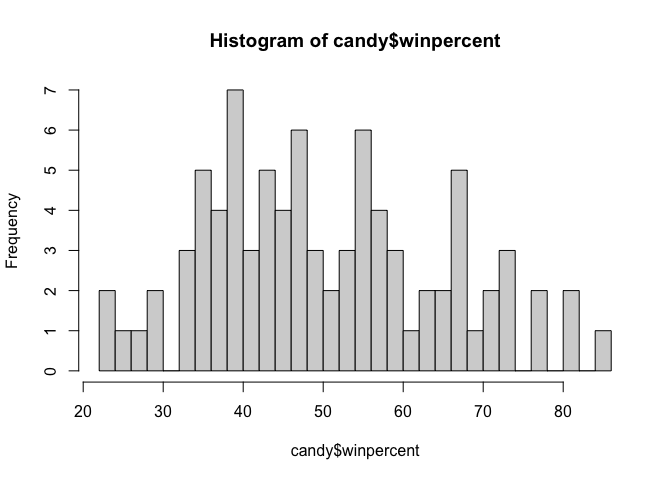
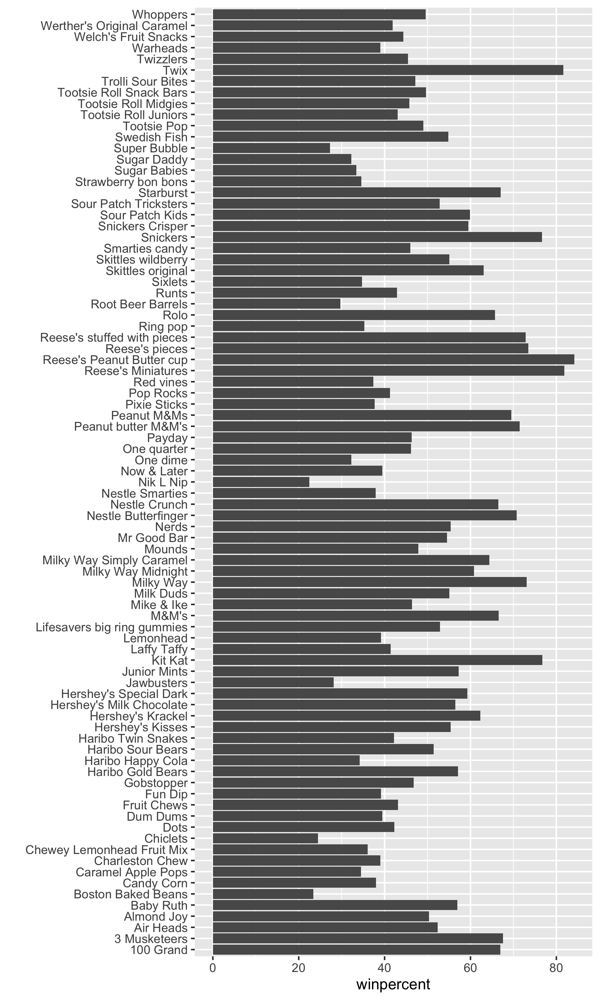
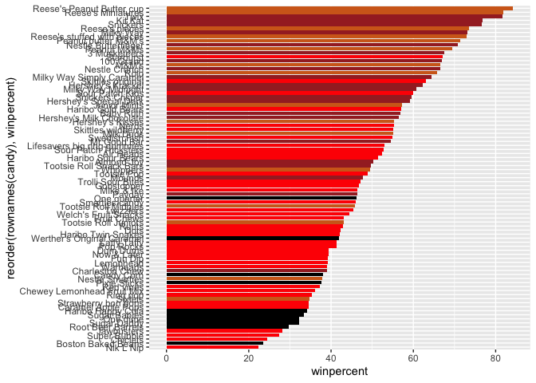
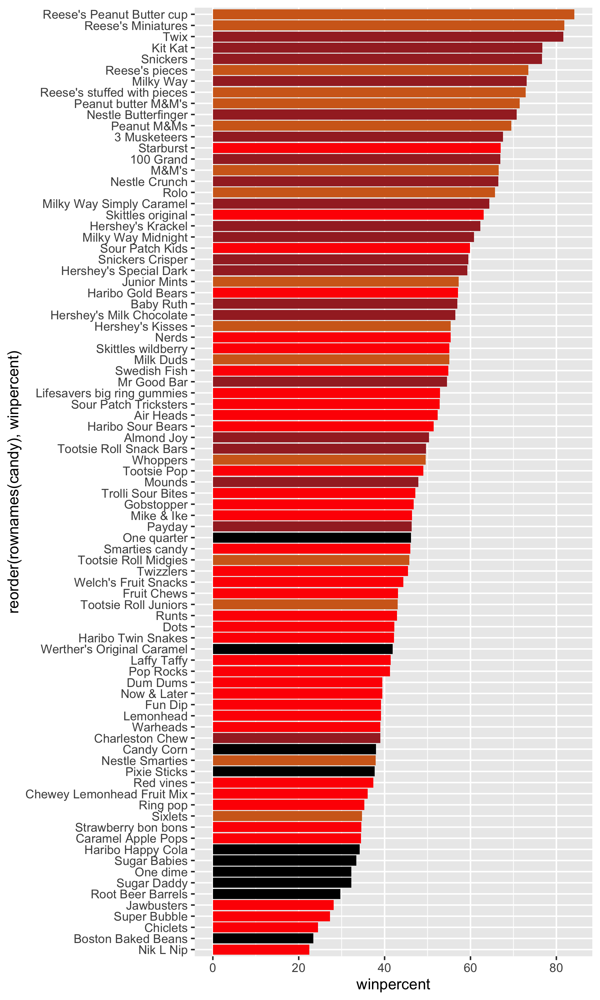
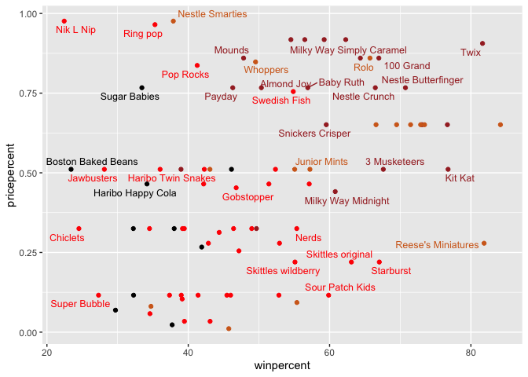
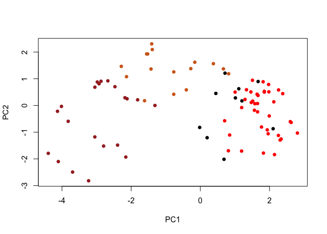
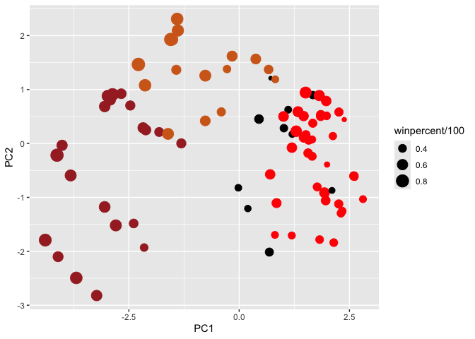
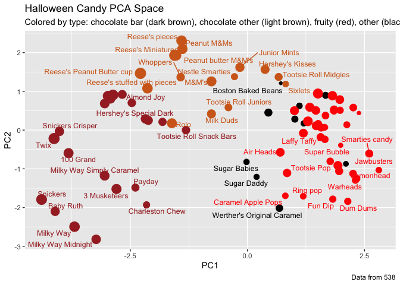

# Class 9: Candy Mini Project
Saket Chodavarapu (PID: A18582086)

- [bg](#bg)
- [Exploratory Analysis](#exploratory-analysis)
- [Overall Candy Rankings](#overall-candy-rankings)
  - [Adding color](#adding-color)
- [Taking a look at pricepercent](#taking-a-look-at-pricepercent)
- [Exploring the correlation
  structure](#exploring-the-correlation-structure)
- [Principal Component Analysis](#principal-component-analysis)
- [Summary](#summary)

## bg

ggplot, stats, corr analysis, principal component analysis \##data
import csv from 538

``` r
candy_file <- read.csv(url("https://raw.githubusercontent.com/fivethirtyeight/data/master/candy-power-ranking/candy-data.csv"))

candy <- data.frame(candy_file, row.names="competitorname")
head(candy)
```

                 chocolate fruity caramel peanutyalmondy nougat crispedricewafer
    100 Grand            1      0       1              0      0                1
    3 Musketeers         1      0       0              0      1                0
    One dime             0      0       0              0      0                0
    One quarter          0      0       0              0      0                0
    Air Heads            0      1       0              0      0                0
    Almond Joy           1      0       0              1      0                0
                 hard bar pluribus sugarpercent pricepercent winpercent
    100 Grand       0   1        0        0.732        0.860   66.97173
    3 Musketeers    0   1        0        0.604        0.511   67.60294
    One dime        0   0        0        0.011        0.116   32.26109
    One quarter     0   0        0        0.011        0.511   46.11650
    Air Heads       0   0        0        0.906        0.511   52.34146
    Almond Joy      0   1        0        0.465        0.767   50.34755

> Q1. How many different candy types are in this dataset?

There are 85 rows in this dataset.

> Q2. How many fruity candy types are in the dataset?

``` r
sum(candy$fruity)
```

    [1] 38

There are 38 fruity candy types in this dataset.

> Q3. What is your favorite candy (other than Twix) in the dataset and
> what is it’s winpercent value?

My favorite candy in the dataset is Air Heads. Its winpercent value is
52.341465.

> Q4. What is the winpercent value for “Kit Kat”?

The winpercent value for “Kit Kat” is 76.7686.

> Q5. What is the winpercent value for “Tootsie Roll Snack Bars”?

The winpercent value for “Tootsie Roll Snack Bars” is 49.653503.

We’ll install the **skimr** package and use the `skim()` function on our
candy data.

``` r
library("skimr")
skim(candy)
```

|                                                  |       |
|:-------------------------------------------------|:------|
| Name                                             | candy |
| Number of rows                                   | 85    |
| Number of columns                                | 12    |
| \_\_\_\_\_\_\_\_\_\_\_\_\_\_\_\_\_\_\_\_\_\_\_   |       |
| Column type frequency:                           |       |
| numeric                                          | 12    |
| \_\_\_\_\_\_\_\_\_\_\_\_\_\_\_\_\_\_\_\_\_\_\_\_ |       |
| Group variables                                  | None  |

Data summary

**Variable type: numeric**

| skim_variable | n_missing | complete_rate | mean | sd | p0 | p25 | p50 | p75 | p100 | hist |
|:---|---:|---:|---:|---:|---:|---:|---:|---:|---:|:---|
| chocolate | 0 | 1 | 0.44 | 0.50 | 0.00 | 0.00 | 0.00 | 1.00 | 1.00 | ▇▁▁▁▆ |
| fruity | 0 | 1 | 0.45 | 0.50 | 0.00 | 0.00 | 0.00 | 1.00 | 1.00 | ▇▁▁▁▆ |
| caramel | 0 | 1 | 0.16 | 0.37 | 0.00 | 0.00 | 0.00 | 0.00 | 1.00 | ▇▁▁▁▂ |
| peanutyalmondy | 0 | 1 | 0.16 | 0.37 | 0.00 | 0.00 | 0.00 | 0.00 | 1.00 | ▇▁▁▁▂ |
| nougat | 0 | 1 | 0.08 | 0.28 | 0.00 | 0.00 | 0.00 | 0.00 | 1.00 | ▇▁▁▁▁ |
| crispedricewafer | 0 | 1 | 0.08 | 0.28 | 0.00 | 0.00 | 0.00 | 0.00 | 1.00 | ▇▁▁▁▁ |
| hard | 0 | 1 | 0.18 | 0.38 | 0.00 | 0.00 | 0.00 | 0.00 | 1.00 | ▇▁▁▁▂ |
| bar | 0 | 1 | 0.25 | 0.43 | 0.00 | 0.00 | 0.00 | 0.00 | 1.00 | ▇▁▁▁▂ |
| pluribus | 0 | 1 | 0.52 | 0.50 | 0.00 | 0.00 | 1.00 | 1.00 | 1.00 | ▇▁▁▁▇ |
| sugarpercent | 0 | 1 | 0.48 | 0.28 | 0.01 | 0.22 | 0.47 | 0.73 | 0.99 | ▇▇▇▇▆ |
| pricepercent | 0 | 1 | 0.47 | 0.29 | 0.01 | 0.26 | 0.47 | 0.65 | 0.98 | ▇▇▇▇▆ |
| winpercent | 0 | 1 | 50.32 | 14.71 | 22.45 | 39.14 | 47.83 | 59.86 | 84.18 | ▃▇▆▅▂ |

From your use of the `skim()` function use the output to answer the
following:

> Q6. Is there any variable/column that looks to be on a different scale
> to the majority of the other columns in the dataset?

The columns `sugarpercent`, `pricepercent`, and `winpercent` contain
continuous values. The rest of the columns are either 0s or 1s.

> Q7. What do you think a zero and one represent for the
> `candy$chocolate` column?

For the `candy$chocolate` column, a one represents a candy that contains
chocolate and a zero represents a candy that does not contain chocolate.

## Exploratory Analysis

> Q8. Plot a histogram of winpercent values using both base R and
> ggplot2.

``` r
hist(candy$winpercent, breaks=30)
```



``` r
library(ggplot2)

ggplot(candy) +
  aes(winpercent) +
  geom_histogram(bins=12, fill="lightblue", col="darkgray")
```


> Q9. Is the distribution of `winpercent` values symmetrical?

The distribution of `winpercent` values is approximately symmetrical.

> Q10. Is the center of the distribution above or below 50%

``` r
mean(candy$winpercent)
```

    [1] 50.31676

``` r
summary(candy$winpercent)
```

       Min. 1st Qu.  Median    Mean 3rd Qu.    Max. 
      22.45   39.14   47.83   50.32   59.86   84.18 

``` r
ggplot(candy) +
  aes(winpercent) +
  geom_boxplot()
```


The mean of the distribution is above 50%, but the median of the
distribution is below 50%.

> Q11. On average is chocolate candy higher or lower ranked than fruit
> candy?

``` r
library(dplyr)
```


    Attaching package: 'dplyr'

    The following objects are masked from 'package:stats':

        filter, lag

    The following objects are masked from 'package:base':

        intersect, setdiff, setequal, union

``` r
choc_candy <- candy %>% filter(chocolate==1)
choc_candy_win_mean <- mean(choc_candy$winpercent)
choc_candy_win_mean
```

    [1] 60.92153

``` r
fruit_candy <- candy %>% filter(fruity==1)
fruit_candy_win_mean <- mean(fruit_candy$winpercent)
fruit_candy_win_mean
```

    [1] 44.11974

On average, chocolate candy is higher ranked than fruit candy.

> Q12. Is this difference statistically significant?

``` r
t.test(choc_candy$winpercent, fruit_candy$winpercent)
```


        Welch Two Sample t-test

    data:  choc_candy$winpercent and fruit_candy$winpercent
    t = 6.2582, df = 68.882, p-value = 2.871e-08
    alternative hypothesis: true difference in means is not equal to 0
    95 percent confidence interval:
     11.44563 22.15795
    sample estimates:
    mean of x mean of y 
     60.92153  44.11974 

Based on the the t-test’s p-value of 2.871e-08, the difference in means
is statistically significant.

## Overall Candy Rankings

> Q13. What are the five least liked candy types in this set?

``` r
head(candy[order(candy$winpercent),], 5)
```

                       chocolate fruity caramel peanutyalmondy nougat
    Nik L Nip                  0      1       0              0      0
    Boston Baked Beans         0      0       0              1      0
    Chiclets                   0      1       0              0      0
    Super Bubble               0      1       0              0      0
    Jawbusters                 0      1       0              0      0
                       crispedricewafer hard bar pluribus sugarpercent pricepercent
    Nik L Nip                         0    0   0        1        0.197        0.976
    Boston Baked Beans                0    0   0        1        0.313        0.511
    Chiclets                          0    0   0        1        0.046        0.325
    Super Bubble                      0    0   0        0        0.162        0.116
    Jawbusters                        0    1   0        1        0.093        0.511
                       winpercent
    Nik L Nip            22.44534
    Boston Baked Beans   23.41782
    Chiclets             24.52499
    Super Bubble         27.30386
    Jawbusters           28.12744

The five least liked candy types in this set are: Nik L Nip, Boston
Baked Beans, Chiclets, Super Bubble, and Jawbusters.

> Q14. What are the top 5 all time favorite candy types out of this set?

``` r
head(candy[order(desc(candy$winpercent)),], 5)
```

                              chocolate fruity caramel peanutyalmondy nougat
    Reese's Peanut Butter cup         1      0       0              1      0
    Reese's Miniatures                1      0       0              1      0
    Twix                              1      0       1              0      0
    Kit Kat                           1      0       0              0      0
    Snickers                          1      0       1              1      1
                              crispedricewafer hard bar pluribus sugarpercent
    Reese's Peanut Butter cup                0    0   0        0        0.720
    Reese's Miniatures                       0    0   0        0        0.034
    Twix                                     1    0   1        0        0.546
    Kit Kat                                  1    0   1        0        0.313
    Snickers                                 0    0   1        0        0.546
                              pricepercent winpercent
    Reese's Peanut Butter cup        0.651   84.18029
    Reese's Miniatures               0.279   81.86626
    Twix                             0.906   81.64291
    Kit Kat                          0.511   76.76860
    Snickers                         0.651   76.67378

The top 5 all time favorite candy types out of this set are: Reese’s
Peanut Butter cups, Reese’s Miniatures, Twix, Kit Kat, and Snickers.

> Q15. Make a first barplot of candy ranking based on `winpercent`
> values.

``` r
ggplot(candy) +
  aes(winpercent, rownames(candy)) +
  geom_col() +
  ylab("") # turn off Y-label that we dont need
```


``` r
ggsave("barplot1.png", height=10, width=6)
```



> Q16. This is quite ugly, use the `reorder()` function to get the bars
> sorted by `winpercent`?

``` r
ggplot(candy) +
  aes(winpercent, reorder(rownames(candy), winpercent)) +
  geom_col() +
  ylab("") # turn off Y-label that we dont need
```


``` r
ggsave("barplot2.png", height=10, width=6)
```


### Adding color

We’ll set up a color vector to symbolize candy type. We’ll first make a
vector of all black values. Then we overwrite the colors: chocolate for
for chocolate candy, brown for candy bars, and red for fruity candy.

``` r
my_cols=rep("black", nrow(candy))
my_cols[as.logical(candy$chocolate)] = "chocolate"
my_cols[as.logical(candy$bar)] = "brown"
my_cols[as.logical(candy$fruity)] = "red"
```

Now we’ll add these colors to the barplot.

``` r
ggplot(candy) +
  aes(winpercent, reorder(rownames(candy), winpercent)) +
  geom_col(fill=my_cols)
```



``` r
ggsave("barplot3.png", height=10, width=6)
```



Now, for the first time, using this plot we can answer questions like:

> Q17. What is the worst ranked chocolate candy?

The worst ranked chocolate candy is Sixlets.

> Q18. What is the best ranked fruity candy?

The best ranked fruity candy is Starburst.

## Taking a look at pricepercent

Let’s analyze value for money by plotting `winpercent` vs
`pricepercent`. We’ll add text labels so that we can identify a given
candy.

``` r
library(ggrepel)

# How about a plot of win vs price
ggplot(candy) +
  aes(x=winpercent, y=pricepercent, label=rownames(candy)) +
  geom_point(col=my_cols) + 
  geom_text_repel(col=my_cols, size=3.3, max.overlaps = 5)
```



> Q19. Which candy type is the highest ranked in terms of `winpercent`
> for the least money - i.e. offers the most bang for your buck?

Reese’s Miniatures is the highest ranked in terms of `winpercent` for
the least money.

> Q20. What are the top 5 most expensive candy types in the dataset and
> of these which is the least popular?

``` r
ord <- order(candy$pricepercent, decreasing=TRUE)
head(candy[ord,c(11,12)], n=5)
```

                             pricepercent winpercent
    Nik L Nip                       0.976   22.44534
    Nestle Smarties                 0.976   37.88719
    Ring pop                        0.965   35.29076
    Hershey's Krackel               0.918   62.28448
    Hershey's Milk Chocolate        0.918   56.49050

The top 5 most expensive candy types in the dataset are Nik L Nip,
Nestle Smarties, Ring pop, Hershey’s Krackel, and Hershey’s Milk
Chocolate. Of these, the least popular is Nik L Nip.

## Exploring the correlation structure

Now let’s see how the variables interact with one another. We’ll use the
**corrplot** package to plot a correlation matrix.

``` r
library(corrplot)
```

    corrplot 0.95 loaded

``` r
cij <- cor(candy)
corrplot(cij)
```


> Q22. Examining this plot what two variables are anti-correlated
> (i.e. have minus values)?

The two variables that are anti-correlated are chocolate and fruity.

> Q23. Similarly, what two variables are most positively correlated?

The two variables that are most positively correlated are chocolate and
bar.

## Principal Component Analysis

Let’s apply PCA using `prcomp()` to our candy dataset. We will set
`scale=TRUE`.

``` r
pca <- prcomp(candy, scale=TRUE)
summary(pca)
```

    Importance of components:
                              PC1    PC2    PC3     PC4    PC5     PC6     PC7
    Standard deviation     2.0788 1.1378 1.1092 1.07533 0.9518 0.81923 0.81530
    Proportion of Variance 0.3601 0.1079 0.1025 0.09636 0.0755 0.05593 0.05539
    Cumulative Proportion  0.3601 0.4680 0.5705 0.66688 0.7424 0.79830 0.85369
                               PC8     PC9    PC10    PC11    PC12
    Standard deviation     0.74530 0.67824 0.62349 0.43974 0.39760
    Proportion of Variance 0.04629 0.03833 0.03239 0.01611 0.01317
    Cumulative Proportion  0.89998 0.93832 0.97071 0.98683 1.00000

Now we’ll plot our PCA score plot of PC1 vs PC2.

``` r
plot(pca$x[,1:2])
```


We’ll change the plotting character and add color.

``` r
plot(pca$x[,1:2], col=my_cols, pch=16)
```



We can make a nicer plot with **ggplot2**, but we need to make a new
data.frame that includes a separate column for each aesthetic to be
displayed in the plot. We’ll make a new data.frame containing the PCA
results along with the candy data.

``` r
# Make a new data-frame with our PCA results and candy data
my_data <- cbind(candy, pca$x[,1:3])
```

``` r
p <- ggplot(my_data) + 
        aes(x=PC1, y=PC2, 
            size=winpercent/100,  
            text=rownames(my_data),
            label=rownames(my_data)) +
        geom_point(col=my_cols)

p
```



We’ll use the **ggrepel** pacakge again and the function
`ggrepel::geom_text_repel()` to label the plot with non-overlapping
candy names. We will also add a title and subtitle.

``` r
library(ggrepel)

p + geom_text_repel(size=3.3, col=my_cols, max.overlaps = 7)  + 
  theme(legend.position = "none") +
  labs(title="Halloween Candy PCA Space",
       subtitle="Colored by type: chocolate bar (dark brown), chocolate other (light brown), fruity (red), other (black)",
       caption="Data from 538")
```



To see more candy labels we can change `max.overlaps` to allow more
overlapping labels. Or, we can pass the ggplot object `p` to **plotly**
to generate an interactive plot where you can hover over points to see
labels.

``` r
#library(plotly)
#ggplotly(p)
```

Let’s take a look at our PCA loadings plot.

``` r
ggplot(pca$rotation) +
  aes(PC1, reorder(rownames(pca$rotation), PC1)) +
  geom_col()
```


> Q24. Complete the code to generate the loadings plot above. What
> original variables are picked up strongly by PC1 in the positive
> direction? Do these make sense to you? Where did you see this
> relationship highlighted previously?

Fruity, pluribus, and hard are picked up strongly by PC1 in the positive
direction. These make sense to me because these three traits are
commonly seen together. This relationship was highlighted previously in
the correlation matrix, with fruity and chocolate being anti-correlated.

## Summary

> Q25. Based on your exploratory analysis, correlation findings, and PCA
> results, what combination of characteristics appears to make a
> “winning” candy? How do these different analyses (visualization,
> correlation, PCA) support or complement each other in reaching this
> conclusion?

The characteristics that appear to make a “winning” candy are chocolate
and bar. The first barplots show chocolate candy clustered towards the
top. The correlation matrix shows a positive correlation between
winpercent and both chocolate and bar. Finally, the PCA analysis shows
that chocolate and bar contribute most to PC1 in the negative direction.
All of these analyses indicate that chocolate and bar are a winning
combination.
